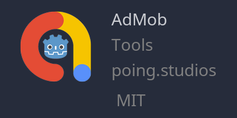

[](https://github.com/poingstudios/godot-admob-plugin/releases)
[](https://godotengine.org/asset-library/asset/1108)
[](https://github.com/poingstudios/godot-admob-android)
[](https://github.com/poingstudios/godot-admob-ios)


# 🦾Godot AdMob Plugin

This addon provides an easy and beautiful way to configure AdMob directly through the editor. Supports [godot-admob-android](https://github.com/poingstudios/godot-admob-android) and [godot-admob-ios](https://github.com/poingstudios/godot-admob-ios).

<div align="center">


</div>

- Video tutorial: https://youtu.be/WpVGn7ZasKM.

# 📦Installation
## 📥Godot Asset Library (recommended)

1. Find the AdMob plugin by `poing.studios` \
   
2. Click Download and Install
3. Enable in Project→Project Settings→Plugins.
4. Download [godot-admob-android](https://github.com/poingstudios/godot-admob-android) and/or [godot-admob-ios](https://github.com/poingstudios/godot-admob-ios) in `Project→Tools→AdMob Download Manager→Android/iOS→LatestVersion`.
5. To know how to deploy, check the README.md of [godot-admob-android](https://github.com/poingstudios/godot-admob-android/#usage) and/or [godot-admob-ios](https://github.com/poingstudios/godot-admob-ios/#usage).

<details>
<summary>Manual install for custom versions.</summary>

1. Pick a [specific version](https://github.com/poingstudios/godot-admob-editor/tags) from tags
2. Download and extract as a `.zip` or `.tar.gz`
3. Copy the extracted `addons/admob` folder into `res://addons` on your project
4. Download [godot-admob-android](https://github.com/poingstudios/godot-admob-android) and/or [godot-admob-ios](https://github.com/poingstudios/godot-admob-ios) in `Project→Tools→AdMob Download Manager→Android/iOS→LatestVersion`.
5. To know how to deploy, check the README.md of [godot-admob-android](https://github.com/poingstudios/godot-admob-android/#usage) and/or [godot-admob-ios](https://github.com/poingstudios/godot-admob-ios/#usage).

</details>

# 🙋‍♂️How to use
After installation, all the methods will be available for use in any `.gd` script.

# 📋Examples

<details>
<summary>Initialize AdMob</summary>

```gdscript
func _ready() -> void:
	#just need to call once
	MobileAds.initialize()
```

</details>

## 🎏Banner Ads

<details>
<summary>Load (will automatically shows)</summary>

```gdscript
# button signal on scene
func _on_load_banner_pressed() -> void:
	var unit_id : String
	if OS.get_name() == "Android":
		unit_id = "ca-app-pub-3940256099942544/6300978111"
	elif OS.get_name() == "iOS":
		unit_id = "ca-app-pub-3940256099942544/2934735716"

	var ad_view := AdView.new(unit_id, AdSize.BANNER, AdPosition.Values.TOP)
	ad_view.load_ad(AdRequest.new())
```

</details>

## 📺Interstitial Ads
<details>
<summary>Load</summary>

```gdscript
var interstitial_ad : InterstitialAd
var interstitial_ad_load_callback := InterstitialAdLoadCallback.new()
func _ready():
	interstitial_ad_load_callback.on_ad_failed_to_load = on_interstitial_ad_failed_to_load
	interstitial_ad_load_callback.on_ad_loaded = on_interstitial_ad_loaded

# button signal on scene
func _on_load_interstitial_pressed() -> void:
	var unit_id : String
	if OS.get_name() == "Android":
		unit_id = "ca-app-pub-3940256099942544/1033173712"
	elif OS.get_name() == "iOS":
		unit_id = "ca-app-pub-3940256099942544/4411468910"

	InterstitialAdLoader.new().load(unit_id, AdRequest.new(), interstitial_ad_load_callback)

func on_interstitial_ad_failed_to_load(adError : LoadAdError) -> void:
	print(adError.message)

func on_interstitial_ad_loaded(interstitial_ad : InterstitialAd) -> void:
	self.interstitial_ad = interstitial_ad
```

</details>

<details>
<summary>Show</summary>

```gdscript
# button signal on scene
func _on_show_pressed():
	if interstitial_ad:
		interstitial_ad.show()
```

</details>

## 🎁Rewarded Ads

<details>
<summary>Load</summary>

```gdscript
var rewarded_ad : RewardedAd
var rewarded_ad_load_callback := RewardedAdLoadCallback.new()

func _ready():
	rewarded_ad_load_callback.on_ad_failed_to_load = on_rewarded_ad_failed_to_load
	rewarded_ad_load_callback.on_ad_loaded = on_rewarded_ad_loaded

# button signal on scene
func _on_load_interstitial_pressed() -> void:
	var unit_id : String
	if OS.get_name() == "Android":
		unit_id = "ca-app-pub-3940256099942544/5224354917"
	elif OS.get_name() == "iOS":
		unit_id = "ca-app-pub-3940256099942544/1712485313"

	RewardedAdLoader.new().load(unit_id, AdRequest.new(), rewarded_ad_load_callback)

func on_rewarded_ad_failed_to_load(adError : LoadAdError) -> void:
	print(adError.message)
	
func on_rewarded_ad_loaded(rewarded_ad : RewardedAd) -> void:
	self.rewarded_ad = rewarded_ad
```

</details>

<details>
<summary>Show</summary>

```gdscript
# button signal on scene
func _on_show_pressed():
	if rewarded_ad:
		rewarded_ad.show()
```

</details>

## 🎁📺Rewarded Interstitial Ads
<details>
<summary>Load</summary>

```gdscript
var rewarded_interstitial_ad : RewardedInterstitialAd
var rewarded_interstitial_ad_load_callback := RewardedInterstitialAdLoadCallback.new()

func _ready():
	rewarded_interstitial_ad_load_callback.on_ad_failed_to_load = on_rewarded_interstitial_ad_failed_to_load
	rewarded_interstitial_ad_load_callback.on_ad_loaded = on_rewarded_interstitial_ad_loaded

# button signal on scene
func _on_load_interstitial_pressed() -> void:
	var unit_id : String
	if OS.get_name() == "Android":
		unit_id = "ca-app-pub-3940256099942544/5354046379"
	elif OS.get_name() == "iOS":
		unit_id = "ca-app-pub-3940256099942544/6978759866"
	
	RewardedInterstitialAdLoader.new().load(unit_id, AdRequest.new(), rewarded_interstitial_ad_load_callback)

func on_rewarded_interstitial_ad_failed_to_load(adError : LoadAdError) -> void:
	print(adError.message)
	
func on_rewarded_interstitial_ad_loaded(rewarded_interstitial_ad : RewardedInterstitialAd) -> void:
	self.rewarded_interstitial_ad = rewarded_interstitial_ad
```

</details>


<details>
<summary>Show</summary>

```gdscript
# button signal on scene
func _on_show_pressed():
	if rewarded_interstitial_ad:
		rewarded_interstitial_ad.show(on_user_earned_reward_listener)
```

</details>


## 📎Useful links:
- 🍏 iOS: https://github.com/poingstudios/godot-admob-ios
- 🤖 Android: https://github.com/poingstudios/godot-admob-android
- ⏳ Plugin for Godot below v4.1: https://github.com/poingstudios/godot-admob-plugin/tree/v2

## 📄Documentation
For a complete documentation of this Plugin including how to mediation: [check here](https://poingstudios.github.io/godot-admob-plugin/).

Alternatively, you can check the docs of AdMob itself of [Android](https://developers.google.com/admob/android/quick-start) and [iOS](https://developers.google.com/admob/ios/quick-start).

## 🙏 Support
If you find our work valuable and would like to support us, consider contributing via these platforms:

[](https://patreon.com/poingstudios)

[](https://ko-fi.com/poingstudios)

[](https://www.paypal.com/donate/?hosted_button_id=EBUVPEGF4BUR8)

Your support helps us continue to improve and maintain this plugin. Thank you for being a part of our community!


## 🆘Getting help
[](https://github.com/poingstudios/godot-admob-plugin/discussions)
[](https://discord.com/invite/YEPvYjSSMk)


## ⭐ Star History
If you appreciate our work, don't forget to give us a star on GitHub! ⭐


