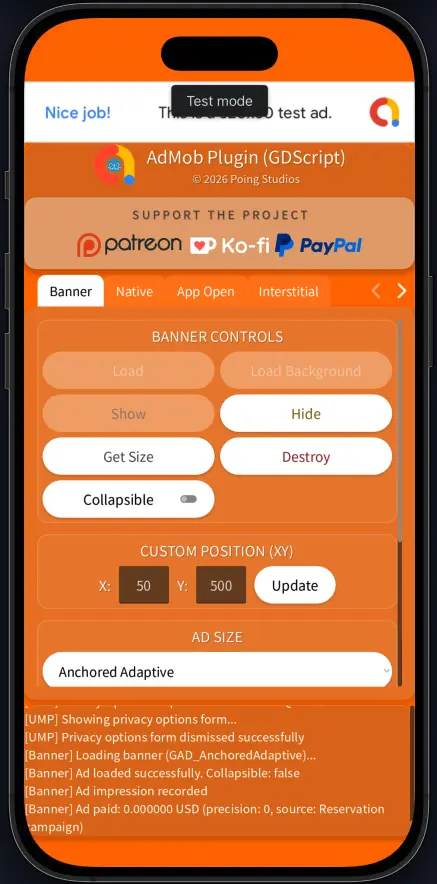
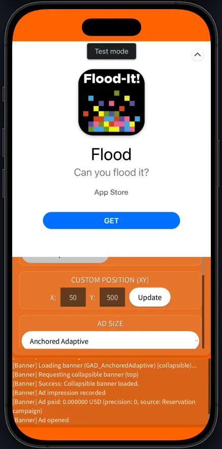
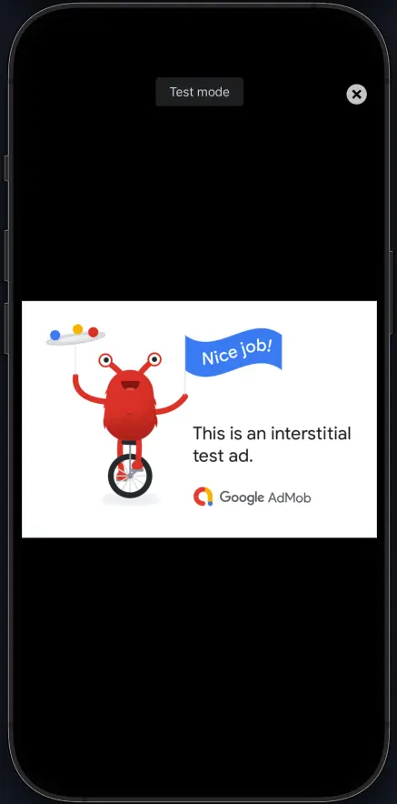
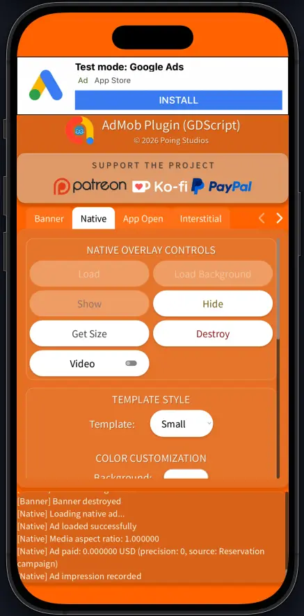
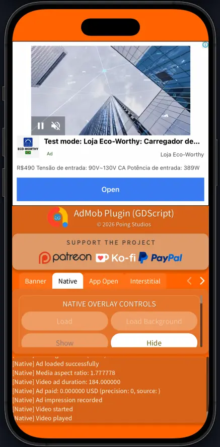
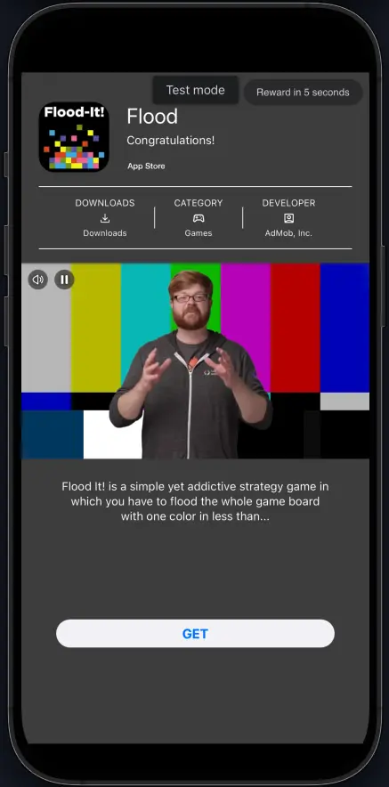
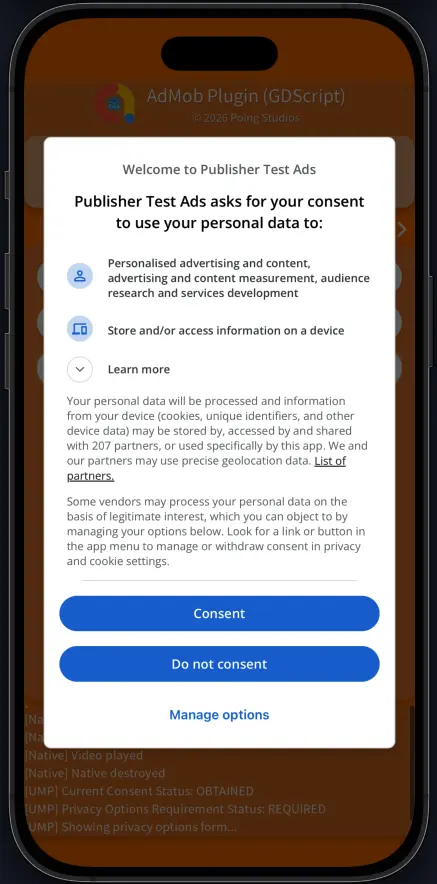
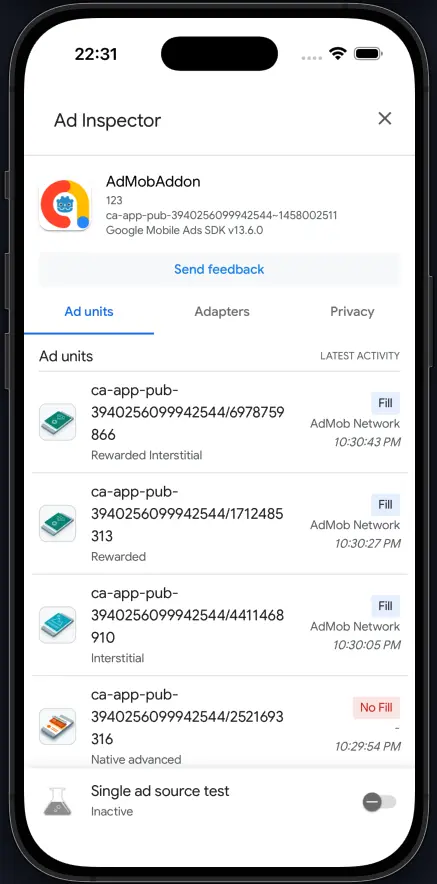

<div align="center">
  <h1>
     Godot AdMob Plugin
  </h1>

  [![VersionBadge]][Releases] [![GodotBadge]][AssetStore] [![StarsBadge]][Stargazers] [![DiscordBadge]][DiscordLink] [![LicenseBadge]][LicenseLink] <br>
  [![DownloadsBadge]][Releases] [![AssetStoreBadge]][AssetStore] <br>
  [![AndroidBadge]][AndroidPlatform] [![iOSBadge]][iOSPlatform] [![GDScriptBadge]][Examples] [![CSharpBadge]][Examples]


  **The complete solution for Google AdMob integration in Godot using GDScript or C#.**  

  

  [🎬 Watch Video Tutorial](https://youtu.be/TB7WhP8mieo) • [📖 Read Documentation][DocumentationLink]

  ---
[📦 Installation](#-installation) • [🎨 Ad Formats](#-ad-formats) • [📋 Examples](#-examples) • [🙏 Support](#-support)

</div>

---

## ✨ Key Features

- **Google SDK Experience**: Designed to mirror the official Google Mobile Ads SDK structure, APIs, and documentation.
- **Godot 4.1.0+**: Native support for Android and iOS with full 1:1 GDScript and C# parity.
- **All Formats & Mediations**: Out-of-the-box support for all Google ad formats and mediation adapters.
- **Editor Mock Ads**: Test and preview ad layouts directly inside the Godot Editor.
- **AI-Agent Ready**: Optimized to work with AI coding assistants for automated configuration.

---

## 📦 Installation

### 📥 Godot Asset Store (Recommended)

1. Open your Godot project.
2. Go to the **AssetLib** tab and search for `AdMob` by `Poing Studios`. \
   
3. Click **Download** and **Install**.

<details>
<summary><b>Manual Installation (Custom Releases)</b></summary>

1. Download the latest `poing-godot-admob-v*.zip` from the [Releases][Releases] page.
2. Extract the ZIP archive directly into your project's root folder (`res://`).

</details>

### ⚙️ Post-Installation Setup

1. Enable the plugin in `Project → Project Settings → Plugins`.
2. Configure the required native dependencies for your target platforms:
    - **Android Setup**: Follow the [Android Platform Guide][AndroidPlatform].
    - **iOS Setup**: Follow the [iOS Platform Guide][iOSPlatform].

> [!TIP]
> If automated package downloads fail, or when updating your Godot Engine version, trigger them manually in the editor via `Project → Tools → AdMob Manager → (Android/iOS) → Download & Install`.

---

## 🎨 Showcase

| Banner | Collapsible Banner | Interstitial | Native |
| :---: | :---: | :---: | :---: |
|  |  |  |  |
| **Native Video** | **Rewarded** | **UMP Consent** | **Ad Inspector** |
|  |  |  |  |

---

## 🙋‍♂️ How to Use
After installation, the `MobileAds` singleton becomes globally available in any script.

## 📋 Examples

### 🏁 Initialize AdMob
Must be called once during game startup before requesting any ads.

<details>
<summary>GDScript</summary>

```gdscript
func _ready() -> void:
	MobileAds.initialize()
```

</details>

<details>
<summary>C#</summary>

```csharp
using PoingStudios.AdMob.Api;

public override void _Ready()
{
	MobileAds.Initialize();
}
```

</details>

### 📱 App Open Ads
Designed to be shown when users cold-start or return to your game.

<details>
<summary>GDScript</summary>

```gdscript
var app_open_ad : AppOpenAd
var app_open_ad_load_callback := AppOpenAdLoadCallback.new()

func _ready() -> void:
	app_open_ad_load_callback.on_ad_failed_to_load = func(ad_error: LoadAdError):
		print("Load failed: ", ad_error.message)
	app_open_ad_load_callback.on_ad_loaded = func(ad: AppOpenAd):
		app_open_ad = ad

func _on_load_app_open_pressed() -> void:
	var unit_id := "ca-app-pub-3940256099942544/9257395921" if OS.get_name() == "Android" else "ca-app-pub-3940256099942544/5575463023"
	AppOpenAdLoader.new().load(unit_id, AdRequest.new(), app_open_ad_load_callback)

func _on_show_pressed() -> void:
	if app_open_ad:
		app_open_ad.show()
```

</details>

<details>
<summary>C#</summary>

```csharp
using Godot;
using PoingStudios.AdMob.Api;
using PoingStudios.AdMob.Api.Core;
using PoingStudios.AdMob.Api.Listeners;

private AppOpenAd _appOpenAd;

private void OnLoadAppOpenPressed()
{
	string unitId = OS.GetName() == "Android" ? "ca-app-pub-3940256099942544/9257395921" : "ca-app-pub-3940256099942544/5575463023";
	
	new AppOpenAdLoader().Load(unitId, new AdRequest(), new AppOpenAdLoadCallback
	{
		OnAdLoaded = ad => _appOpenAd = ad,
		OnAdFailedToLoad = err => GD.Print(err.Message)
	});
}

private void OnShowPressed()
{
	if (_appOpenAd != null)
	{
		_appOpenAd.Show();
	}
}
```

</details>

### 🎏 Banner Ads
Rectangular ads occupying a portion of the screen layout (supports standard and collapsible formats).

<details>
<summary>GDScript</summary>

```gdscript
var ad_view: AdView

func _on_load_banner_pressed() -> void:
	var unit_id := "ca-app-pub-3940256099942544/6300978111" if OS.get_name() == "Android" else "ca-app-pub-3940256099942544/2934735716"
	ad_view = AdView.new(unit_id, AdSize.BANNER, AdPosition.TOP)
	ad_view.load_ad(AdRequest.new())
```

</details>

<details>
<summary>C#</summary>

```csharp
using Godot;
using PoingStudios.AdMob.Api;
using PoingStudios.AdMob.Api.Core;

private AdView _adView;

private void OnLoadBannerPressed()
{
	string unitId = OS.GetName() == "Android" ? "ca-app-pub-3940256099942544/6300978111" : "ca-app-pub-3940256099942544/2934735716";
	_adView = new AdView(unitId, AdSize.Banner, AdPosition.Top);
	_adView.LoadAd(new AdRequest());
}
```

</details>

### 📺 Interstitial Ads
Full-screen ads covering the interface until dismissed by the user.

<details>
<summary>GDScript</summary>

```gdscript
var interstitial_ad : InterstitialAd
var load_callback := InterstitialAdLoadCallback.new()

func _ready() -> void:
	load_callback.on_ad_failed_to_load = func(error: LoadAdError):
		print("Load failed: ", error.message)
	load_callback.on_ad_loaded = func(ad: InterstitialAd):
		interstitial_ad = ad

func _on_load_interstitial_pressed() -> void:
	var unit_id := "ca-app-pub-3940256099942544/1033173712" if OS.get_name() == "Android" else "ca-app-pub-3940256099942544/4411468910"
	InterstitialAdLoader.new().load(unit_id, AdRequest.new(), load_callback)

func _on_show_pressed() -> void:
	if interstitial_ad:
		interstitial_ad.show()
```

</details>

<details>
<summary>C#</summary>

```csharp
using Godot;
using PoingStudios.AdMob.Api;
using PoingStudios.AdMob.Api.Core;
using PoingStudios.AdMob.Api.Listeners;

private InterstitialAd _interstitialAd;

private void OnLoadInterstitialPressed()
{
	string unitId = OS.GetName() == "Android" ? "ca-app-pub-3940256099942544/1033173712" : "ca-app-pub-3940256099942544/4411468910";
	
	new InterstitialAdLoader().Load(unitId, new AdRequest(), new InterstitialAdLoadCallback
	{
		OnAdLoaded = ad => _interstitialAd = ad,
		OnAdFailedToLoad = err => GD.Print(err.Message)
	});
}

private void OnShowPressed()
{
	if (_interstitialAd != null)
	{
		_interstitialAd.Show();
	}
}
```

</details>

### 🖼️ Native Overlay Ads
Highly customizable native layout format supporting small templates and native video playback.

<details>
<summary>GDScript</summary>

```gdscript
var native_overlay_ad: NativeOverlayAd

func _on_load_native_pressed() -> void:
	var unit_id := "ca-app-pub-3940256099942544/2247696110" if OS.get_name() == "Android" else "ca-app-pub-3940256099942544/3986624511"
	
	NativeOverlayAd.load(unit_id, AdRequest.new(), NativeAdOptions.new(), func(ad: NativeOverlayAd, error: LoadAdError):
		if error:
			print("Native ad failed to load: ", error.message)
			return
		native_overlay_ad = ad
		_render_native_ad()
	)

func _render_native_ad() -> void:
	var style := NativeTemplateStyle.new()
	style.template_id = NativeTemplateStyle.MEDIUM
	native_overlay_ad.render_template(style, AdPosition.BOTTOM)
```

</details>

<details>
<summary>C#</summary>

```csharp
using Godot;
using PoingStudios.AdMob.Api;
using PoingStudios.AdMob.Api.Core;

private NativeOverlayAd _nativeOverlayAd;

private void OnLoadNativePressed()
{
	string unitId = OS.GetName() == "Android" ? "ca-app-pub-3940256099942544/2247696110" : "ca-app-pub-3940256099942544/3986624511";

	NativeOverlayAd.Load(unitId, new AdRequest(), new NativeAdOptions(), (ad, error) => {
		if (error != null)
		{
			GD.Print("Native ad failed to load: " + error.Message);
			return;
		}
		_nativeOverlayAd = ad;
		RenderNativeAd();
	});
}

private void RenderNativeAd()
{
	var style = new NativeTemplateStyle();
	style.TemplateId = NativeTemplateStyle.Medium;
	_nativeOverlayAd.RenderTemplate(style, AdPosition.Bottom);
}
```

</details>

### 🎁 Rewarded Ads
Allows you to give users in-game rewards for watching videos or interacting with ads.

<details>
<summary>GDScript</summary>

```gdscript
var rewarded_ad : RewardedAd
var load_callback := RewardedAdLoadCallback.new()

func _ready() -> void:
	load_callback.on_ad_failed_to_load = func(error: LoadAdError):
		print("Load failed: ", error.message)
	load_callback.on_ad_loaded = func(ad: RewardedAd):
		rewarded_ad = ad

func _on_load_rewarded_pressed() -> void:
	var unit_id := "ca-app-pub-3940256099942544/5224354917" if OS.get_name() == "Android" else "ca-app-pub-3940256099942544/1712485313"
	RewardedAdLoader.new().load(unit_id, AdRequest.new(), load_callback)

func _on_show_pressed() -> void:
	if rewarded_ad:
		rewarded_ad.show()
```

</details>

<details>
<summary>C#</summary>

```csharp
using Godot;
using PoingStudios.AdMob.Api;
using PoingStudios.AdMob.Api.Core;
using PoingStudios.AdMob.Api.Listeners;

private RewardedAd _rewardedAd;

private void OnLoadRewardedPressed()
{
	string unitId = OS.GetName() == "Android" ? "ca-app-pub-3940256099942544/5224354917" : "ca-app-pub-3940256099942544/1712485313";

	new RewardedAdLoader().Load(unitId, new AdRequest(), new RewardedAdLoadCallback
	{
		OnAdLoaded = ad => _rewardedAd = ad,
		OnAdFailedToLoad = err => GD.Print(err.Message)
	});
}

private void OnShowPressed()
{
	if (_rewardedAd != null)
	{
		_rewardedAd.Show(new OnUserEarnedRewardListener
		{
			OnUserEarnedReward = reward => GD.Print($"Reward: {reward.Amount} {reward.Type}")
		});
	}
}
```

</details>

### 🎁📺 Rewarded Interstitial Ads
Shows rewarded ads automatically during game transitions without requiring the user to opt-in.

<details>
<summary>GDScript</summary>

```gdscript
var rewarded_interstitial_ad : RewardedInterstitialAd
var load_callback := RewardedInterstitialAdLoadCallback.new()

func _ready() -> void:
	load_callback.on_ad_failed_to_load = func(error: LoadAdError):
		print("Load failed: ", error.message)
	load_callback.on_ad_loaded = func(ad: RewardedInterstitialAd):
		rewarded_interstitial_ad = ad

func _on_load_rewarded_interstitial_pressed() -> void:
	var unit_id := "ca-app-pub-3940256099942544/5354046379" if OS.get_name() == "Android" else "ca-app-pub-3940256099942544/6978759866"
	RewardedInterstitialAdLoader.new().load(unit_id, AdRequest.new(), load_callback)

func _on_show_pressed() -> void:
	if rewarded_interstitial_ad:
		rewarded_interstitial_ad.show(OnUserEarnedRewardListener.new(func(reward: RewardItem):
			print("User rewarded: ", reward.amount, " ", reward.type)
		))
```

</details>

<details>
<summary>C#</summary>

```csharp
using Godot;
using PoingStudios.AdMob.Api;
using PoingStudios.AdMob.Api.Core;
using PoingStudios.AdMob.Api.Listeners;

private RewardedInterstitialAd _rewardedInterstitialAd;

private void OnLoadRewardedInterstitialPressed()
{
	string unitId = OS.GetName() == "Android" ? "ca-app-pub-3940256099942544/5354046379" : "ca-app-pub-3940256099942544/6978759866";
	
	new RewardedInterstitialAdLoader().Load(unitId, new AdRequest(), new RewardedInterstitialAdLoadCallback
	{
		OnAdLoaded = ad => _rewardedInterstitialAd = ad,
		OnAdFailedToLoad = err => GD.Print(err.Message)
	});
}

private void OnShowPressed()
{
	if (_rewardedInterstitialAd != null)
	{
		_rewardedInterstitialAd.Show(new OnUserEarnedRewardListener
		{
			OnUserEarnedReward = reward => GD.Print($"Reward: {reward.Amount} {reward.Type}")
		});
	}
}
```

</details>

---

## 🔒 Privacy & Debugging Tools

### 🌐 User Messaging Platform (UMP)
Request user consent for personalized ads under regulations like GDPR, COPPA, and CCPA.

<details>
<summary>GDScript</summary>

```gdscript
func request_user_consent() -> void:
	var params := ConsentRequestParameters.new()
	ConsentInformation.request_consent_info_update(params, OnConsentInfoUpdateListener.new(
		func():
			if ConsentInformation.is_consent_form_available():
				ConsentForm.load_and_show_consent_form_if_required(OnConsentFormDismissedListener.new(
					func(error: FormError):
						if error:
							print("Consent form error: ", error.message)
				)),
		func(error: FormError):
			print("Consent info update error: ", error.message)
	))
```

</details>

<details>
<summary>C#</summary>

```csharp
using PoingStudios.AdMob.Api.Ump;
using PoingStudios.AdMob.Api.Ump.Listeners;

public void RequestUserConsent()
{
	var params = new ConsentRequestParameters();
	UserMessagingPlatform.ConsentInformation.RequestConsentInfoUpdate(params, new OnConsentInfoUpdateListener
	{
		OnConsentInfoUpdateSuccess = () =>
		{
			if (UserMessagingPlatform.ConsentInformation.IsConsentFormAvailable())
			{
				UserMessagingPlatform.ConsentForm.LoadAndShowConsentFormIfRequired(new OnConsentFormDismissedListener
				{
					OnConsentFormDismissed = error =>
					{
						if (error != null)
						{
							GD.Print("Consent form error: " + error.Message);
						}
					}
				});
			}
		},
		OnConsentInfoUpdateFailure = error => GD.Print("Consent info update error: " + error.Message)
	});
}
```

</details>

### 🔍 Ad Inspector
Google's diagnostic overlay to verify ad unit configurations, adapter statuses, and real-time ad delivery.

<details>
<summary>GDScript</summary>

```gdscript
func open_diagnostics() -> void:
	MobileAds.open_ad_inspector()
```

</details>

<details>
<summary>C#</summary>

```csharp
using PoingStudios.AdMob.Api;

public void OpenDiagnostics()
{
	MobileAds.OpenAdInspector();
}
```

</details>

---

## 📎 Useful Links

- 🍎 [iOS Platform Setup][iOSPlatform]
- 🤖 [Android Platform Setup][AndroidPlatform]
- ⏳ [Godot 3 Support (Legacy branch)](https://github.com/poingstudios/godot-admob-plugin/tree/v1)

## 📄 Documentation

For complete documentation including third-party mediation networks setup: **[Official Documentation][DocumentationLink]**.

Alternatively, check AdMob's official SDK references for [Android](https://developers.google.com/admob/android/quick-start) and [iOS](https://developers.google.com/admob/ios/quick-start).

## 🙏 Support

If you find our work valuable and would like to support ongoing development, consider contributing:

[![PatreonBadge]][PatreonLink] [![KofiBadge]][KofiLink] [![PaypalBadge]][PaypalLink]

## 🆘 Getting Help

[![DiscussionsBadge]][DiscussionsLink] [![DiscordHelpBadge]][DiscordLink]

---

## Star History

[](https://www.star-history.com/?repos=poingstudios%2Fgodot-admob-plugin&type=date&legend=top-left)

[VersionBadge]: https://badgen.net/github/release/poingstudios/godot-admob-plugin/latest
[GodotBadge]: https://badgen.net/badge/Godot/4.1.0+/478CBF?icon=godotengine
[StarsBadge]: https://badgen.net/github/stars/poingstudios/godot-admob-plugin
[DiscordBadge]: https://badgen.net/badge/_/Discord/7289DA?label=&icon=discord
[LicenseBadge]: https://badgen.net/github/license/poingstudios/godot-admob-plugin?label=License
[DownloadsBadge]: https://badgen.net/github/assets-dl/poingstudios/godot-admob-plugin?label=Downloads&color=green
[AssetStoreBadge]: https://badgen.net/badge/Download/Asset%20Store/green
[AndroidBadge]: https://badgen.net/badge/_/Android/3DDC84?label=&icon=android
[iOSBadge]: https://badgen.net/badge/_/iOS/000000?label=&icon=apple
[GDScriptBadge]: https://badgen.net/badge/_/GDScript/478CBF?label=&icon=godotengine
[CSharpBadge]: https://badgen.net/badge/_/C%23/239120?label=&icon=csharp
[PatreonBadge]: https://badgen.net/badge/Support%20us%20on/Patreon/orange?icon=patreon
[KofiBadge]: https://badgen.net/badge/Buy%20us%20a/coffee/yellow?icon=kofi
[PaypalBadge]: https://badgen.net/badge/Donate/via%20Paypal/blue?icon=paypal
[DiscussionsBadge]: https://badgen.net/badge/_/Discussions/green?label=
[DiscordHelpBadge]: https://badgen.net/badge/_/Discord/7289DA?label=&icon=discord

[DocumentationLink]: https://poingstudios.github.io/godot-admob-plugin/latest/
[Releases]: https://github.com/poingstudios/godot-admob-plugin/releases
[Stargazers]: https://github.com/poingstudios/godot-admob-plugin/stargazers
[DiscordLink]: https://discord.com/invite/YEPvYjSSMk
[LicenseLink]: https://github.com/poingstudios/godot-admob-plugin/blob/master/LICENSE
[AssetStore]: https://store.godotengine.org/asset/poingstudios/admob/
[AndroidPlatform]: https://github.com/poingstudios/godot-admob-plugin/tree/master/platforms/android
[iOSPlatform]: https://github.com/poingstudios/godot-admob-plugin/tree/master/platforms/ios
[Examples]: #-examples
[PatreonLink]: https://patreon.com/poingstudios
[KofiLink]: https://ko-fi.com/poingstudios
[PaypalLink]: https://www.paypal.com/donate/?hosted_button_id=EBUVPEGF4BUR8
[DiscussionsLink]: https://github.com/poingstudios/godot-admob-plugin/discussions
