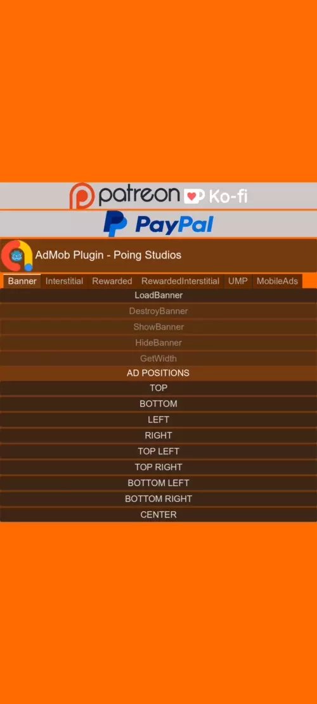
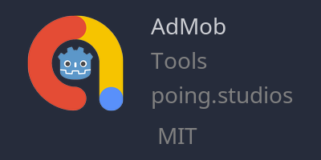

<div align="center">
  <h1>
     Godot AdMob Plugin
  </h1>

  [![VersionBadge]][Releases] [![StarsBadge]][Stargazers] [![DiscordBadge]][DiscordLink] [![LicenseBadge]][LicenseLink] <br>
  [![DownloadsBadge]][Releases] [![AssetLibraryBadge]][AssetLib] <br>
  [![AndroidBadge]][AndroidPlatform] [![iOSBadge]][iOSPlatform] [![GDScriptBadge]][Examples] [![CSharpBadge]][Examples]

  **The complete solution for AdMob integration in Godot using GDScript or C#.**  
  Supports [Android][AndroidPlatform] and [iOS][iOSPlatform] natively.

  

  [🎬 Watch Video Tutorial](https://youtu.be/TB7WhP8mieo) • [📖 Read Documentation][DocumentationLink]

  ---

  [📦 Installation](#-installation) • [📋 Examples](#-examples) • [🙏 Support](#-support--community)

</div>

## 📦 Installation

### 📥 Godot Asset Library (recommended)

1. Find the AdMob plugin by `poing.studios` \
   
2. Click **Download** and **Install**.

<details>
<summary><b>Manual installation for custom versions</b></summary>

1. Pick a [specific version](https://github.com/poingstudios/godot-admob-editor/tags) from tags.
2. Download and extract as a `.zip` or `.tar.gz`.
3. Copy the extracted `addons/admob` folder into `res://addons` in your project.

</details>

### ⚙️ Post-installation

1. Enable the plugin in `Project → Project Settings → Plugins`.
2. **Setup Platform Dependencies**:
    - **Android**: Follow the [Android Setup Guide][AndroidPlatform].
    - **iOS**: Follow the [iOS Setup Guide][iOSPlatform].

> [!TIP]
> If the automatic download fails, you can manually trigger it via `Project → Tools → AdMob Manager → Download & Install`.

## 🙋‍♂️ How to use
After installation, the `MobileAds` singleton becomes available in any script.

## 📋 Examples

## 🏁Initialize AdMob
<details>
<summary>GDScript</summary>

```gdscript
func _ready() -> void:
	#just need to call once
	MobileAds.initialize()
```

</details>

<details>
<summary>C#</summary>

```csharp
using PoingStudios.AdMob.Api;

public override void _Ready()
{
	//just need to call once
	MobileAds.Initialize();
}
```

</details>

## 🎏Banner Ads

<details>
<summary>GDScript</summary>

### Load (will automatically show)
```gdscript
# button signal on scene
func _on_load_banner_pressed() -> void:
	var unit_id : String
	if OS.get_name() == "Android":
		unit_id = "ca-app-pub-3940256099942544/6300978111"
	elif OS.get_name() == "iOS":
		unit_id = "ca-app-pub-3940256099942544/2934735716"

	var ad_view := AdView.new(unit_id, AdSize.BANNER, AdPosition.Values.TOP)
	ad_view.load_ad(AdRequest.new())
```

</details>

<details>
<summary>C#</summary>

### Load (will automatically show)
```csharp
using Godot;
using PoingStudios.AdMob.Api;
using PoingStudios.AdMob.Api.Core;

// button signal on scene
private void OnLoadBannerPressed()
{
	string unitId = "";
	if (OS.GetName() == "Android")
	{
		unitId = "ca-app-pub-3940256099942544/6300978111";
	}
	else if (OS.GetName() == "iOS")
	{
		unitId = "ca-app-pub-3940256099942544/2934735716";
	}

	var adView = new AdView(unitId, AdSize.Banner, AdPosition.Top);
	adView.LoadAd(new AdRequest());
}
```

</details>

## 📺Interstitial Ads
<details>
<summary>GDScript</summary>

### Load
```gdscript
var interstitial_ad : InterstitialAd
var interstitial_ad_load_callback := InterstitialAdLoadCallback.new()
func _ready():
	interstitial_ad_load_callback.on_ad_failed_to_load = on_interstitial_ad_failed_to_load
	interstitial_ad_load_callback.on_ad_loaded = on_interstitial_ad_loaded

# button signal on scene
func _on_load_interstitial_pressed() -> void:
	var unit_id : String
	if OS.get_name() == "Android":
		unit_id = "ca-app-pub-3940256099942544/1033173712"
	elif OS.get_name() == "iOS":
		unit_id = "ca-app-pub-3940256099942544/4411468910"

	InterstitialAdLoader.new().load(unit_id, AdRequest.new(), interstitial_ad_load_callback)

func on_interstitial_ad_failed_to_load(adError : LoadAdError) -> void:
	print(adError.message)

func on_interstitial_ad_loaded(interstitial_ad : InterstitialAd) -> void:
	self.interstitial_ad = interstitial_ad
```

### Show
```gdscript
# button signal on scene
func _on_show_pressed():
	if interstitial_ad:
		interstitial_ad.show()
```

</details>

<details>
<summary>C#</summary>

### Load
```csharp
using Godot;
using PoingStudios.AdMob.Api;
using PoingStudios.AdMob.Api.Core;
using PoingStudios.AdMob.Api.Listeners;

private InterstitialAd _interstitialAd;

// button signal on scene
private void OnLoadInterstitialPressed()
{
	string unitId = "";
	if (OS.GetName() == "Android")
	{
		unitId = "ca-app-pub-3940256099942544/1033173712";
	}
	else if (OS.GetName() == "iOS")
	{
		unitId = "ca-app-pub-3940256099942544/4411468910";
	}
	
	new InterstitialAdLoader().Load(unitId, new AdRequest(), new InterstitialAdLoadCallback
	{
		OnAdLoaded = ad => _interstitialAd = ad,
		OnAdFailedToLoad = err => GD.Print(err.Message)
	});
}
```

### Show
```csharp
// button signal on scene
private void OnShowPressed()
{
	if (_interstitialAd != null)
	{
		_interstitialAd.Show();
	}
}
```

</details>

## 🎁Rewarded Ads

<details>
<summary>GDScript</summary>

### Load
```gdscript
var rewarded_ad : RewardedAd
var rewarded_ad_load_callback := RewardedAdLoadCallback.new()

func _ready():
	rewarded_ad_load_callback.on_ad_failed_to_load = on_rewarded_ad_failed_to_load
	rewarded_ad_load_callback.on_ad_loaded = on_rewarded_ad_loaded

# button signal on scene
func _on_load_rewarded_pressed() -> void:
	var unit_id : String
	if OS.get_name() == "Android":
		unit_id = "ca-app-pub-3940256099942544/5224354917"
	elif OS.get_name() == "iOS":
		unit_id = "ca-app-pub-3940256099942544/1712485313"

	RewardedAdLoader.new().load(unit_id, AdRequest.new(), rewarded_ad_load_callback)

func on_rewarded_ad_failed_to_load(adError : LoadAdError) -> void:
	print(adError.message)
	
func on_rewarded_ad_loaded(rewarded_ad : RewardedAd) -> void:
	self.rewarded_ad = rewarded_ad
```

### Show
```gdscript
# button signal on scene
func _on_show_pressed():
	if rewarded_ad:
		rewarded_ad.show()
```

</details>

<details>
<summary>C#</summary>

### Load
```csharp
using Godot;
using PoingStudios.AdMob.Api;
using PoingStudios.AdMob.Api.Core;
using PoingStudios.AdMob.Api.Listeners;

private RewardedAd _rewardedAd;

// button signal on scene
private void OnLoadRewardedPressed()
{
	string unitId = "";
	if (OS.GetName() == "Android")
	{
		unitId = "ca-app-pub-3940256099942544/5224354917";
	}
	else if (OS.GetName() == "iOS")
	{
		unitId = "ca-app-pub-3940256099942544/1712485313";
	}

	new RewardedAdLoader().Load(unitId, new AdRequest(), new RewardedAdLoadCallback
	{
		OnAdLoaded = ad => _rewardedAd = ad,
		OnAdFailedToLoad = err => GD.Print(err.Message)
	});
}
```

### Show
```csharp
// button signal on scene
private void OnShowPressed()
{
	if (_rewardedAd != null)
	{
		_rewardedAd.Show(new OnUserEarnedRewardListener
		{
			OnUserEarnedReward = reward => GD.Print($"Reward: {reward.Amount} {reward.Type}")
		});
	}
}
```

</details>

## 🎁📺Rewarded Interstitial Ads
<details>
<summary>GDScript</summary>

### Load
```gdscript
var rewarded_interstitial_ad : RewardedInterstitialAd
var rewarded_interstitial_ad_load_callback := RewardedInterstitialAdLoadCallback.new()

func _ready():
	rewarded_interstitial_ad_load_callback.on_ad_failed_to_load = on_rewarded_interstitial_ad_failed_to_load
	rewarded_interstitial_ad_load_callback.on_ad_loaded = on_rewarded_interstitial_ad_loaded

# button signal on scene
func _on_load_rewarded_interstitial_pressed() -> void:
	var unit_id : String
	if OS.get_name() == "Android":
		unit_id = "ca-app-pub-3940256099942544/5354046379"
	elif OS.get_name() == "iOS":
		unit_id = "ca-app-pub-3940256099942544/6978759866"
	
	RewardedInterstitialAdLoader.new().load(unit_id, AdRequest.new(), rewarded_interstitial_ad_load_callback)

func on_rewarded_interstitial_ad_failed_to_load(adError : LoadAdError) -> void:
	print(adError.message)
	
func on_rewarded_interstitial_ad_loaded(rewarded_interstitial_ad : RewardedInterstitialAd) -> void:
	self.rewarded_interstitial_ad = rewarded_interstitial_ad
```

### Show
```gdscript
# button signal on scene
func _on_show_pressed():
	if rewarded_interstitial_ad:
		rewarded_interstitial_ad.show(on_user_earned_reward_listener)
```

</details>

<details>
<summary>C#</summary>

### Load
```csharp
using Godot;
using PoingStudios.AdMob.Api;
using PoingStudios.AdMob.Api.Core;
using PoingStudios.AdMob.Api.Listeners;

private RewardedInterstitialAd _rewardedInterstitialAd;

// button signal on scene
private void OnLoadRewardedInterstitialPressed()
{
	string unitId = "";
	if (OS.GetName() == "Android")
	{
		unitId = "ca-app-pub-3940256099942544/5354046379";
	}
	else if (OS.GetName() == "iOS")
	{
		unitId = "ca-app-pub-3940256099942544/6978759866";
	}
	
	new RewardedInterstitialAdLoader().Load(unitId, new AdRequest(), new RewardedInterstitialAdLoadCallback
	{
		OnAdLoaded = ad => _rewardedInterstitialAd = ad,
		OnAdFailedToLoad = err => GD.Print(err.Message)
	});
}
```

### Show
```csharp
// button signal on scene
private void OnShowPressed()
{
	if (_rewardedInterstitialAd != null)
	{
		_rewardedInterstitialAd.Show(new OnUserEarnedRewardListener
		{
			OnUserEarnedReward = reward => GD.Print($"Reward: {reward.Amount} {reward.Type}")
		});
	}
}
```


</details>

## 📎 Useful links

- 🍎 [iOS Platform Setup][iOSPlatform]
- 🤖 [Android Platform Setup][AndroidPlatform]
- ⏳ [Legacy Support (Godot < 4.2)](https://github.com/poingstudios/godot-admob-plugin/tree/v3)

## 📄 Documentation

For complete documentation including mediation setup: **[Official Documentation][DocumentationLink]**.

Alternatively, check AdMob's original docs for [Android](https://developers.google.com/admob/android/quick-start) or [iOS](https://developers.google.com/admob/ios/quick-start).

## 🙏 Support

If you find our work valuable and would like to support us, consider contributing via these platforms:

[![PatreonBadge]][PatreonLink]

[![KofiBadge]][KofiLink]

[![PaypalBadge]][PaypalLink]

Your support helps us continue to improve and maintain this plugin. Thank you for being a part of our community!

## 🆘 Getting help

[![DiscussionsBadge]][DiscussionsLink] [![DiscordHelpBadge]][DiscordLink]


## ⭐ Star History
If you appreciate our work, don't forget to give us a star on GitHub! ⭐


[VersionBadge]: https://img.shields.io/github/v/tag/poingstudios/godot-admob-plugin?label=Version&style=flat-square
[StarsBadge]: https://img.shields.io/github/stars/poingstudios/godot-admob-plugin?style=flat-square
[DiscordBadge]: https://img.shields.io/badge/Discord-7289DA?style=flat-square&logo=discord&logoColor=white
[LicenseBadge]: https://img.shields.io/github/license/poingstudios/godot-admob-plugin?style=flat-square
[DownloadsBadge]: https://img.shields.io/github/downloads/poingstudios/godot-admob-plugin/total?label=Downloads&style=flat-square&color=darkgreen
[AssetLibraryBadge]: https://img.shields.io/badge/Download-Asset%20Library-darkgreen?style=flat-square
[AndroidBadge]: https://img.shields.io/badge/Android-3DDC84?style=flat-square&logo=android&logoColor=white
[iOSBadge]: https://img.shields.io/badge/iOS-000000?style=flat-square&logo=ios&logoColor=white
[GDScriptBadge]: https://img.shields.io/badge/GDScript-478CBF?style=flat-square&logo=godot-engine&logoColor=white
[CSharpBadge]: https://img.shields.io/badge/C%23-239120?style=flat-square&logo=csharp&logoColor=white
[PatreonBadge]: https://img.shields.io/badge/Support%20us%20on-Patreon-orange?style=for-the-badge&logo=patreon
[KofiBadge]: https://img.shields.io/badge/Buy%20us%20a-coffee-yellow?style=for-the-badge&logo=ko-fi
[PaypalBadge]: https://img.shields.io/badge/Donate-via%20Paypal-blue?style=for-the-badge&logo=paypal
[DiscussionsBadge]: https://img.shields.io/badge/Discussions-green?style=for-the-badge
[DiscordHelpBadge]: https://img.shields.io/badge/Discord-7289DA?style=for-the-badge&logo=discord&logoColor=white

[DocumentationLink]: https://poingstudios.github.io/godot-admob-plugin/latest/
[Releases]: https://github.com/poingstudios/godot-admob-plugin/releases
[Stargazers]: https://github.com/poingstudios/godot-admob-plugin/stargazers
[DiscordLink]: https://discord.com/invite/YEPvYjSSMk
[LicenseLink]: https://github.com/poingstudios/godot-admob-plugin/blob/master/LICENSE
[AssetLib]: https://godotengine.org/asset-library/asset/2063
[AndroidPlatform]: https://github.com/poingstudios/godot-admob-plugin/tree/master/platforms/android
[iOSPlatform]: https://github.com/poingstudios/godot-admob-plugin/tree/master/platforms/ios
[Examples]: #-examples
[PatreonLink]: https://patreon.com/poingstudios
[KofiLink]: https://ko-fi.com/poingstudios
[PaypalLink]: https://www.paypal.com/donate/?hosted_button_id=EBUVPEGF4BUR8
[DiscussionsLink]: https://github.com/poingstudios/godot-admob-plugin/discussions
