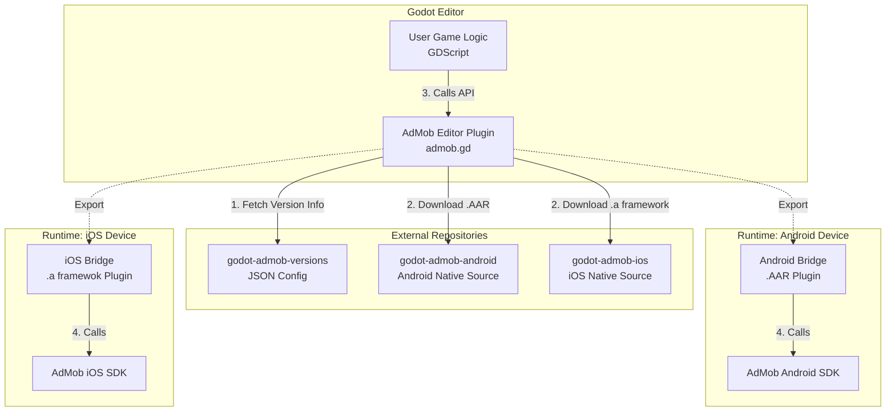

# Overview

The **Godot AdMob Editor Plugin** acts as a central hub for integrating Google AdMob into Godot projects. Instead of bundling large native libraries directly, it operates as a sophisticated **Download Manager** and **Configuration Tool**.

1.  **Dynamic Dependency Management**: The plugin connects to external repositories to fetch the correct version of native binaries (Android AARs and iOS Frameworks) compatible with the current plugin version.
2.  **Cross-Platform Abstraction**: It provides a unified GDScript API (`MobileAds`, `AdView`, etc.) that the developer uses.
3.  **Native Execution**: At runtime, this GDScript API communicates with the platform-specific "Bridges" (Java/Kotlin for Android, Objective-C/Swift for iOS), which in turn talk to the official Google Mobile Ads SDKs.

