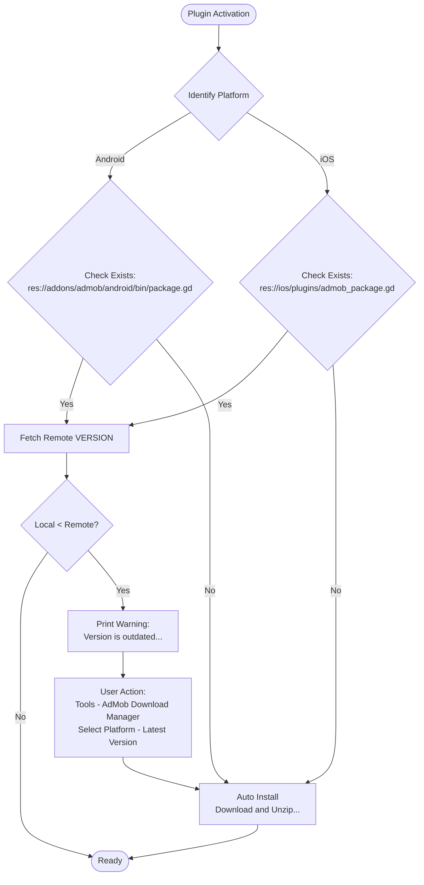

# Plugin Lifecycle

This document outlines the lifecycle of the plugin upon activation, specifically regarding dependency management for Android and iOS.

## Activation & Dependency Checks

When the plugin is activated, it executes a pipeline to verify the integrity and version of its native dependencies.

# Plugin Lifecycle

This document outlines the lifecycle of the plugin upon activation, specifically regarding dependency management for Android and iOS.

## Activation & Dependency Checks

When the plugin is activated, it executes a pipeline to verify the integrity and version of its native dependencies. The process is self-healing and semi-automated for both platforms.

### Common Flow

1.  **Platform Identification**: The plugin first identifies the target platform (Android or iOS).
2.  **File Existence Verification**: It checks for the existence of a platform-specific package file:
    *   **Android**: `res://addons/admob/android/bin/package.gd`
    *   **iOS**: `res://ios/plugins/admob_package.gd`
3.  **Automatic Installation**: If the platform-specific package file is **missing**, the plugin automatically:
    *   Downloads the relevant platform binaries.
    *   Unzips them into the appropriate plugin directory (`res://addons/admob/android/bin/` for Android, `res://ios/plugins/` for iOS).
4.  **Version Validation**: If the platform-specific package file **exists**, the plugin fetches the `VERSION` variable from the [godot-admob-versions](https://github.com/poingstudios/godot-admob-versions) repository.
    *   **If Local < Remote**: It prints a warning in the output:
        > "The [Platform] plugin version is outdated. Current: [X] Latest: [Y]. Automatically update via: 'Tools -> AdMob Download Manager -> [Platform] -> LatestVersion'"
5.  **Automatic Update**: The "LatestVersion" tool mentioned in the warning performs the same action as the **Automatic Installation** step (Download + Unzip).

