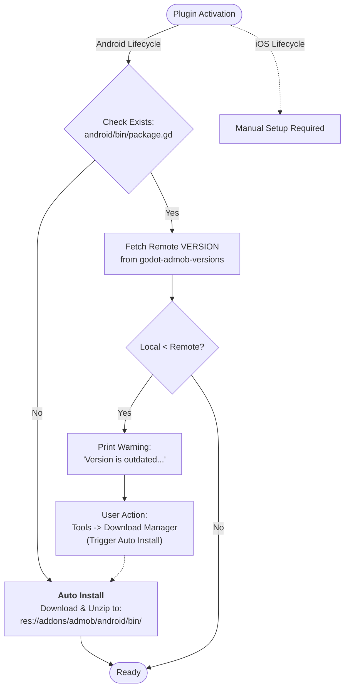

# Plugin Lifecycle

This document outlines the lifecycle of the plugin upon activation, specifically regarding dependency management for Android and iOS.

## Activation & Dependency Checks

When the plugin is activated, it executes a pipeline to verify the integrity and version of its native dependencies.

### Android Flow
The Android setup is designed to be self-healing and semi-automated.

1.  **File Existence Verification**: The plugin checks if the file `res://addons/admob/android/bin/package.gd` exists.
2.  **Automatic Installation**: If the file is **missing**, the plugin automatically:
    *   Downloads the Android binaries.
    *   Unzips them into `res://addons/admob/android/bin/`.
3.  **Version Validation**: If the file **exists**, the plugin fetches the `VERSION` variable from the [godot-admob-versions](https://github.com/poingstudios/godot-admob-versions) repository.
    *   **If Local < Remote**: It prints a warning in the output:
        > "The Android plugin version is outdated. Current: [X] Latest: [Y]. Automatically update via: 'Tools -> AdMob Download Manager -> Android -> LatestVersion'"
4.  **Automatic Update**: The "LatestVersion" tool mentioned in the warning performs the same action as the **Automatic Installation** step (Download + Unzip).

### iOS Flow
The iOS setup requires manual intervention. The user is responsible for downloading and installing the necessary frameworks manually.

