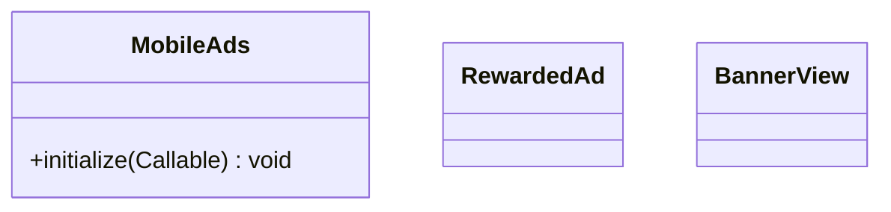

# Class diagrams
Class diagrams are an important part of designing and documenting the architecture of software systems. In the case of the **AdMob plugin**, class diagrams can be used to visualize the relationships between the various classes and objects that make up the plugin's architecture.

The following class diagram provides an overview of the classes that make up the AdMob plugin:

