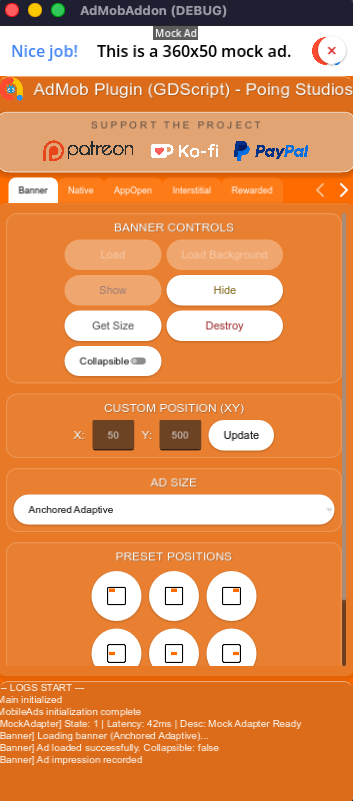
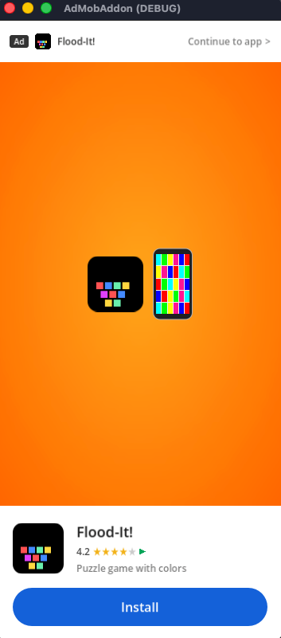
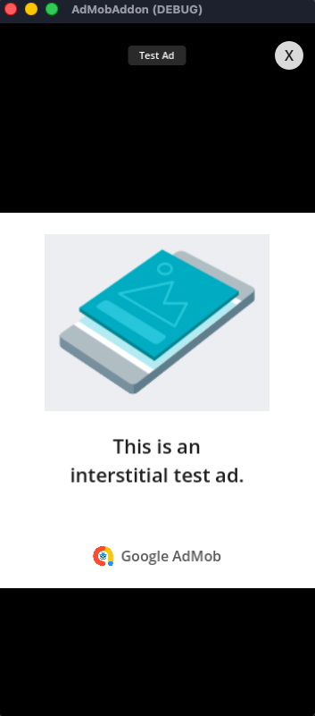
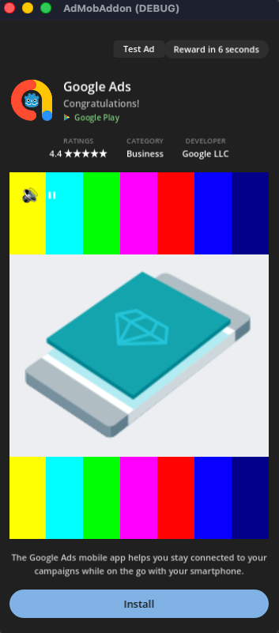
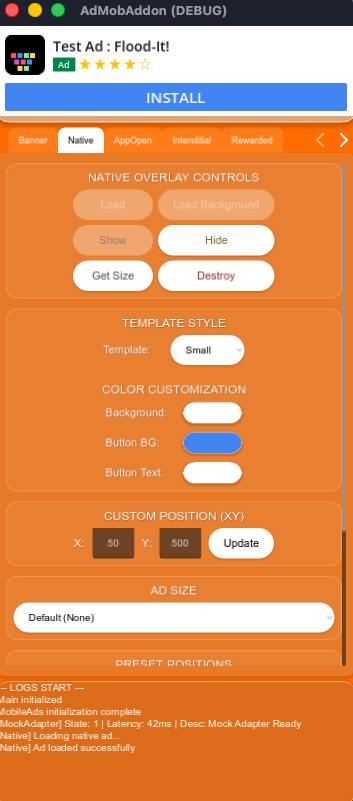

# Preview Mock Ads in Editor

Use the Preview Mock Ads feature to test your ad integration inside the Godot Editor before building your game to mobile devices. 

Mock ads simulate ad behavior, lifecycle callbacks (such as load, show, clicks, and dismissals), and UI presentation directly in the Godot Editor. This helps you validate your ad integration flow, custom layouts, and UI placement early in development.

## How it works

The plugin automatically detects when your game is running on a desktop platform (Windows, macOS, or Linux) inside the Godot Editor (`OS.has_feature("editor")`). Instead of failing due to missing Android or iOS native singletons, the plugin instantiates mock singletons and nodes automatically.

You do not need to change any of your GDScript or C# code or configuration to use mock ads. All standard `MobileAds` and ad format APIs work exactly the same way.

## Benefits of using mock ads

Mock ads are a powerful tool during development to help you:

- **Validate your ad integration flow**: Verify that initialization, load, show, and all other lifecycle callbacks fire correctly in your game logic.
- **Preview visual layouts**: Check how the ads display in your game's UI, including the layout and positioning of different ad formats relative to your UI elements (such as `SafeArea`).
- **Rapid iteration**: Avoid the time-consuming process of compiling, exporting, and deploying your app to physical devices or simulators just to test basic ad behaviors.

## Supported formats

The mock system simulates the visual appearance and interactions for each major ad format:

### Banners
- Renders a container on screen matching your selected standard size (e.g., standard banner, large banner, medium rectangle, leaderboard) or custom size.
- Supports custom screen positions (`AdPosition.custom(x, y)`).
- **Collapsible Banners**: If you specify `collapsible` in the ad request's extras, the mock banner will display a collapse/expand toggle button (`^`), letting you test the layout adjustments and callbacks when the banner collapses.
- Renders a close button (`×`) to simulate dismissals.



### App Open
- Renders a full-screen App Open mock ad overlay on startup to test transitions.



### Interstitial
- Renders a full-screen interstitial card with realistic branding.
- Features a close button (`X`) that hides the ad and fires the dismissal callbacks.



### Rewarded & Rewarded Interstitial
- Renders a full-screen rewarded overlay.
- Plays a simulated video countdown timer (typically 8 seconds).
- Features a warning popup if you attempt to close the ad before the countdown finishes ("Are you sure you want to close? You will lose your reward").
- Automatically grants the reward (fires `on_rewarded_ad_user_earned_reward` / `UserEarnedReward` callback with mock currency details) once the countdown completes.
- The close button (`X`) is only displayed/enabled after the minimum duration (5 seconds) or when the reward is granted.



### Native Overlay
- Renders template-styled mock Native Ads (supporting both `small` and `medium` layouts) using Godot Control nodes.
- Shows mock assets like app icons, titles, call-to-action buttons, and body texts.



## Lifecycle Callbacks

The mock plugins trigger the exact same signals as the real mobile SDKs, allowing you to debug your code's response to ad events.

For example, when you request an interstitial ad, the following sequence is simulated:

=== "GDScript"

    ```gdscript
    var _interstitial_ad: InterstitialAd

    func _load_interstitial():
        var listener := InterstitialAdLoadListener.new()
        listener.on_ad_loaded = func(ad: InterstitialAd) -> void:
            _interstitial_ad = ad
            # Simulated callback fires after 0.5s
            print("Ad loaded in Editor!")
            
        listener.on_ad_failed_to_load = func(error: LoadAdError) -> void:
            print("Failed to load: ", error.message)
            
        InterstitialAd.load(unit_id, AdRequest.new(), listener)

    func _show_interstitial():
        if _interstitial_ad:
            var full_screen_listener := FullScreenContentCallback.new()
            full_screen_listener.on_ad_showed_full_screen_content = func() -> void:
                print("Ad shown in Editor!")
                
            full_screen_listener.on_ad_dismissed_full_screen_content = func() -> void:
                print("Ad dismissed in Editor!")
                
            _interstitial_ad.full_screen_content_callback = full_screen_listener
            _interstitial_ad.show()
    ```

=== "C#"

    ```csharp
    private InterstitialAd _interstitialAd;

    private void LoadInterstitial()
    {
        var listener = new InterstitialAdLoadListener
        {
            OnAdLoaded = (ad) =>
            {
                _interstitialAd = ad;
                // Simulated callback fires after 0.5s
                GD.Print("Ad loaded in Editor!");
            },
            OnAdFailedToLoad = (error) =>
            {
                GD.Print("Failed to load: " + error.Message);
            }
        };

        InterstitialAd.Load(unitId, new AdRequest(), listener);
    }

    private void ShowInterstitial()
    {
        if (_interstitialAd != null)
        {
            _interstitialAd.FullScreenContentCallback = new FullScreenContentCallback
            {
                OnAdShowedFullScreenContent = () => GD.Print("Ad shown in Editor!"),
                OnAdDismissedFullScreenContent = () => GD.Print("Ad dismissed in Editor!")
            };
            _interstitialAd.Show();
        }
    }
    ```

## Limitations

!!! warning "Do not replace on-device testing"

    While the Preview Mock Ads feature is great for verifying logic flow and UI layouts, you must still perform final checks on physical mobile devices or simulators/emulators before publishing your game.

- Mock ads do **not** simulate network latency, network failure states, or actual mediation network adapters.
- Mock ads do **not** verify that your AdMob App ID or Ad Unit IDs are registered/valid on the AdMob servers. Refer to [Enable test ads](enable_test_ads.md) to set up test devices for physical device validation.
