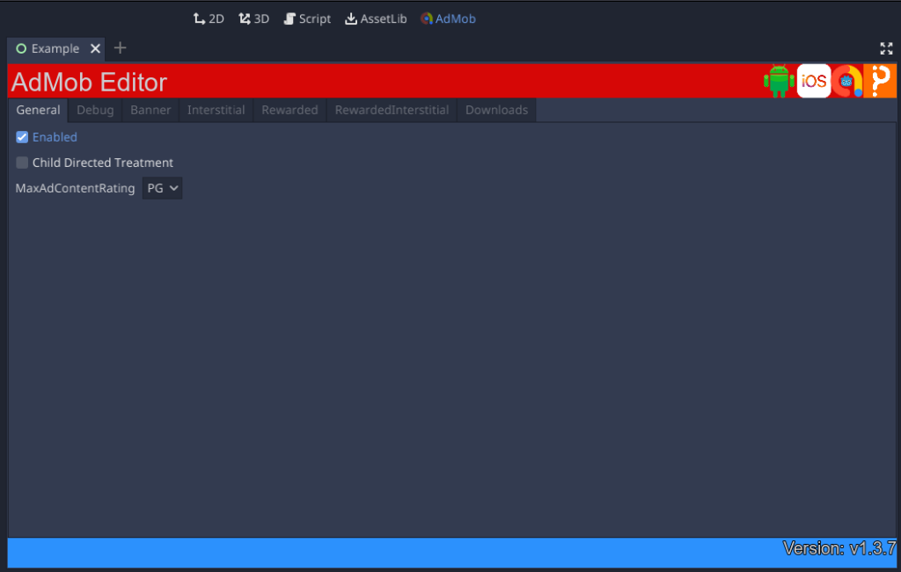
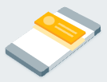
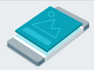
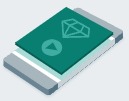
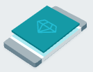

# Get Started

!!! note "Godot 3 (v1) Documentation"
    This documentation is for the **v1** plugin, which supports **Godot 3.x** only.
    For **Godot 4.2+**, see the [stable documentation](https://poingstudios.github.io/godot-admob-plugin/stable/).

Integrating the AdMob plugin into your Godot project for **Godot 3** allows you to easily display Google Mobile Ads on Android and iOS devices.

---

## Prerequisites

- **Godot Engine 3.x Mono/Standard Edition** (v3.3 or higher).
- **Recommended**: An active [AdMob Account](https://admob.google.com/) with registered Android/iOS apps.

=== "Android"

    - Godot Android Build Template enabled.
    - Target Android SDK version configured.

=== "iOS"

    - macOS machine with Xcode installed.
    - Active Apple Developer account.

---

## Download & Import the Plugin

1. Download the latest release from the [GitHub Releases](https://github.com/poingstudios/godot-admob-plugin/releases) page.
2. Extract the archive and copy the `addons/admob` folder into your Godot project's `res://addons/` directory.
3. Open Godot Editor, navigate to **Project -> Project Settings -> Plugins** and toggle the status of the **AdMob** plugin to **Enabled**.

Once enabled, the plugin automatically registers the `MobileAds` autoload singleton into your project.

---

## Download Platform Templates

After enabling the plugin, the **AdMob** tab will appear in the main workspace tabs (next to **2D**, **3D**, **AssetLib**, etc.) at the top of the editor. Open it to access the AdMob Manager.

=== "Android"

    Select **Download Android Template**. The plugin will automatically download and extract the required template files (`.aar` and `.gdap`) directly into your `res://android/plugins/` folder (no manual zip extraction required).

=== "iOS"

    Select **Download iOS Template**. The plugin will automatically download and extract the required template files (`.gdip` and library files) directly into your `res://ios/plugins/` folder (no manual zip extraction required).

---

## Configuration

Click the **AdMob** tab (next to **AssetLib** at the top of the editor) to open the configuration panel. Configure the following:



| Option | Tab | Description |
|--------|-----|-------------|
| **Enabled** | General | Toggle mock ads / editor plugin functionality globally. |
| **Child Directed Treatment** | General | Configure COPPA (Child-Directed Treatment) compliance. |
| **MaxAdContentRating** | General | Set maximum ad content rating filter (`G`, `PG`, `T`, `MA`). |
| **Banner Size** | Banner | Select banner size (Standard, Large, Medium Rectangle, etc.). |
| **Position** | Banner | Choose banner position (Top or Bottom). |
| **Show Instantly** | Banner | Automatically display banner when loaded. |
| **Respect Safe Area** | Banner | Adjust banner placement to avoid screen cutouts and notches. |

### App ID Setup

Before exporting to a physical device, set your [AdMob App ID](https://support.google.com/admob/answer/7356431) (`ca-app-pub-XXXXXXXXXXXXXXXX~YYYYYYYYYY`) for each target platform:

=== "Android"

    Add a `<meta-data>` tag with your App ID inside `<application>` in `res://android/build/AndroidManifest.xml`:

    ```xml
    <!-- Sample AdMob app ID: ca-app-pub-3940256099942544~3347511713 -->
    <meta-data
        tools:replace="android:value"
        android:name="com.google.android.gms.ads.APPLICATION_ID"
        android:value="ca-app-pub-xxxxxxxxxxxxxxxx~yyyyyyyyyy"/>
    ```

=== "iOS"

    You can configure your AdMob App ID directly within the Godot Editor without manually editing configuration files:

    1. Open the export settings via **Project -> Export...**.
    2. Select your **iOS** export preset.
    3. In the **Options** tab, navigate to the **Plugins Plist** section.
    4. Set the **Gad Application Identifier** field to your AdMob App ID (e.g. `ca-app-pub-xxxxxxxxxxxxxxxx~yyyyyyyyyy`).

    !!! tip "Alternative Setup"
        You can also pre-define `GADApplicationIdentifier="ca-app-pub-xxxxxxxxxxxxxxxx~yyyyyyyyyy"` directly under the `[plist]` section of `res://ios/plugins/admob.gdip`.

---

## Initialize the SDK

Prior to loading ads, the Google Mobile Ads SDK must be initialized. If **Is Enabled** is active in your configuration, the plugin will initialize itself automatically on startup.

If you prefer to initialize manually, or want to monitor completion, connect to the `initialization_complete` signal:

=== "GDScript"

    ```gdscript
    func _ready() -> void:
        MobileAds.connect("initialization_complete", self, "_on_AdMob_initialization_complete")
        MobileAds.initialize()

    func _on_AdMob_initialization_complete(status: int, adapter_name: String) -> void:
        print("AdMob Initialized: ", status)
    ```

=== "C#"

    ```csharp
    public override void _Ready()
    {
        MobileAds.Connect("initialization_complete", this, nameof(_on_AdMob_initialization_complete));
        MobileAds.Call("initialize");
    }

    private void _on_AdMob_initialization_complete(int status, string adapterName)
    {
        GD.Print("AdMob Initialized: " + status);
    }
    ```

---

## Select an ad format

The Google Mobile Ads SDK is now successfully imported, and you are prepared to integrate an ad into your app. AdMob provides a variety of ad formats, allowing you to select the one that aligns best with your app's user experience.

### Banner
<div class="image-text-container" markdown="1">



Banner ads are rectangular advertisements, consisting of either images or text, that are integrated into an app's layout. These ads remain on the screen while users engage with the app and can automatically refresh after a designated time interval. If you're new to mobile advertising, banner ads provide an excellent starting point for your ad implementation journey.

</div>

[Implement banner ads](ad_formats/banner.md){ .md-button .md-button--primary }

### Interstitial
<div class="image-text-container" markdown="1">



Interstitial ads are expansive, full-screen advertisements that overlay an app's interface and persist until they are closed by the user. They are most effective when strategically placed during natural pauses in the app's execution, such as between levels of a game or immediately after the completion of a task.

</div>

[Implement interstitial ads](ad_formats/interstitial.md){ .md-button .md-button--primary }

### Rewarded
<div class="image-text-container" markdown="1">



Rewarded video ads are immersive, full-screen video advertisements that provide users with the choice to watch them entirely. In return for their time and attention, users receive in-app rewards or benefits.

</div>

[Implement rewarded ads](ad_formats/rewarded.md){ .md-button .md-button--primary }

### Rewarded Interstitial
<div class="image-text-container" markdown="1">



A Rewarded Interstitial is a specific form of incentivized ad format that allows you to provide rewards in exchange for ads that appear automatically during natural app transitions. Unlike regular rewarded ads, users are not obligated to actively opt in to view a Rewarded Interstitial; they are seamlessly integrated into the app experience.

</div>

[Implement rewarded interstitial ads](ad_formats/rewarded_interstitial.md){ .md-button .md-button--primary }

<style>
  .image-text-container {
    display: flex;
    align-items: center;
  }
  .image-text-container img {
    margin-right: 20px;
    max-width: 130px;
    height: auto;
  }
</style>
