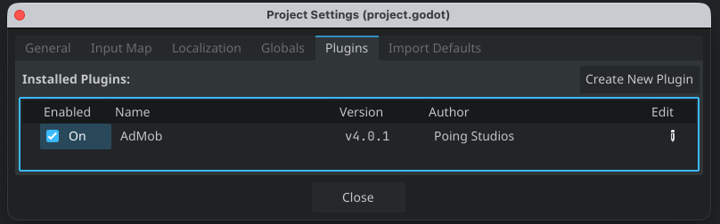
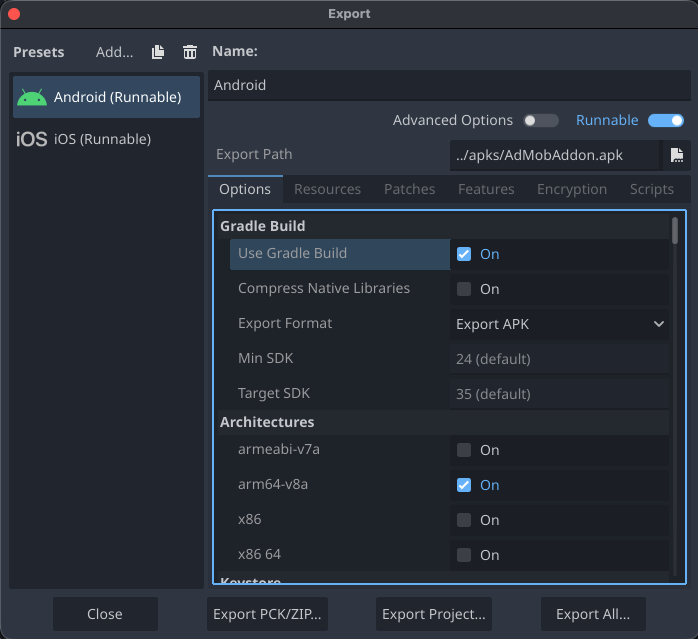
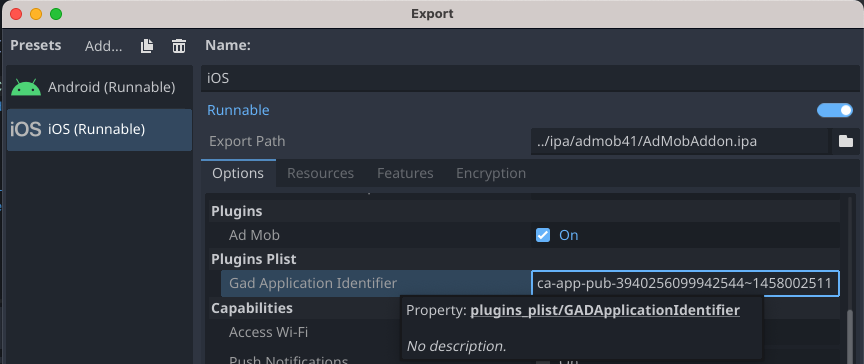
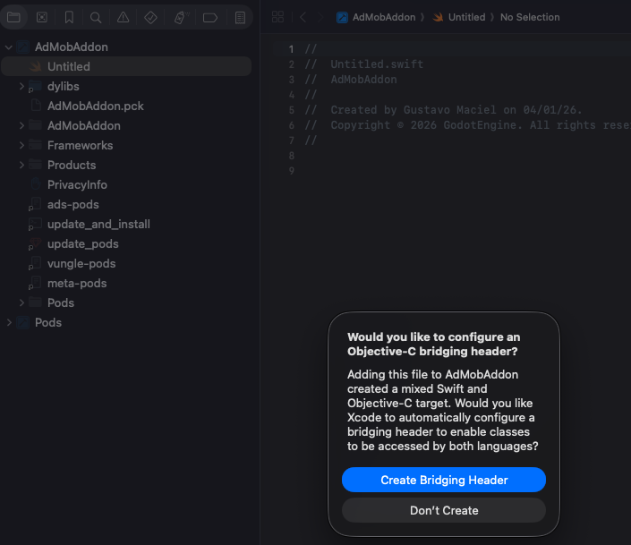

# Começar

Integrar o plugin AdMob no seu projeto Godot, especificamente para Godot v4.2+, é a etapa inicial e crucial para habilitar a exibição de anúncios e a geração de receita. Depois de incorporar este plugin com sucesso, você terá a flexibilidade de selecionar entre vários formatos de anúncios, como Banner ou Intersticial, e prosseguir com as etapas de implementação necessárias.

Este documento é baseado em:

- [Documentação de Início Rápido do Google Mobile Ads SDK para Android](https://developers.google.com/admob/android/quick-start)
- [Documentação de Início Rápido do Google Mobile Ads SDK para iOS](https://developers.google.com/admob/ios/quick-start)

## Pré-requisitos

- Implantar no Android:
	- Usar Godot v4.2 ou superior
	- `minSdkVersion` de 24 ou superior
	- `compileSdkVersion` de 36 ou superior
- Implantar no iOS:
	- Usar Godot v4.1 ou superior
	- Usar Xcode 26.2 ou superior
	- Target iOS 14.0 ou superior
- Recomendado: [Criar uma conta do AdMob](https://support.google.com/admob/answer/7356219?visit_id=638286911958663013-3847536692&rd=1) e [registrar um aplicativo](https://support.google.com/admob/answer/9989980?visit_id=638286911964685099-3190075945&rd=1).

## Baixar o Plugin Godot AdMob da Poing Studios

O Plugin Godot AdMob da Poing Studios simplifica o processo para desenvolvedores Godot incorporar o Google Mobile Ads em seus aplicativos Android e iOS, eliminando a necessidade de escrever código Java/Kotlin ou Objective-C++. Em vez disso, este plugin oferece uma interface baseada em GDScript e C# para solicitações de anúncios, que pode ser integrada de forma transparente ao seu projeto Godot.

Para acessar o plugin, você pode baixar o pacote Godot fornecido ou explorar seu código-fonte no GitHub através dos links abaixo.

[Baixar do GitHub](https://github.com/poingstudios/godot-admob-plugin/releases/latest){ .md-button .md-button--primary } [Baixar da Asset Store](https://store.godotengine.org/asset/poingstudios/admob/){ .md-button .md-button--primary } [Código Fonte](https://github.com/poingstudios/godot-admob-plugin){ .md-button .md-button--primary }

### Importando o Plugin Godot AdMob no Projeto

O plugin AdMob para Godot está convenientemente disponível através da Asset Store do Godot. Para importar este plugin em seu projeto Godot, siga estas etapas:

1. Abra seu projeto Godot.
2. Navegue até a Asset Store dentro do editor do Godot.
3. Na barra de pesquisa, digite `AdMob` e certifique-se de que o distribuidor seja `Poing Studios`.

4. Localize o plugin AdMob e clique no botão `Download`.
5. Assim que o download for concluído, vá para `Projeto → Configurações do Projeto` dentro do editor do Godot.
6. Na seção `Plugins`, localize o plugin `AdMob` e ative-o.

7. As bibliotecas para Android e iOS serão baixadas e instaladas automaticamente.
8. Com essas etapas, você terá integrado com sucesso o plugin AdMob no seu projeto Godot sem a necessidade de importações manuais de arquivos adicionais.

## Download & Instalação
!!! info
    Esta seção normalmente **não é necessária**, pois o plugin gerencia as bibliotecas automaticamente. Siga estas etapas apenas se o download automático falhar.

=== "Android"

	Para integrar a biblioteca Android necessária para o AdMob no Godot, siga estas etapas:

	1. No Godot, navegue até `Projeto → Ferramentas → AdMob Manager → Android → Download & Install`.
	2. Esta ação irá baixar e instalar a biblioteca Android apropriada no seu projeto, localizada em `res://addons/admob/android/bin/`.

	Se encontrar problemas com o download, você pode tentar baixar a biblioteca manualmente clicando [aqui](https://github.com/poingstudios/godot-admob-android/releases/latest).

=== "iOS"

	Para integrar a biblioteca iOS necessária para o AdMob no Godot, siga estas etapas:

	1. No Godot, navegue até `Projeto → Ferramentas → AdMob Manager → iOS → Download & Install`.
	2. Esta ação irá baixar e instalar automaticamente a biblioteca iOS necessária no seu projeto em `res://ios/plugins/`.

	Se encontrar problemas com o download, você pode tentar baixar a biblioteca manualmente clicando [aqui](https://github.com/poingstudios/godot-admob-ios/releases/latest).

### Exportando

=== "Android"

	1. Instale o [Android Build Template](https://docs.godotengine.org/en/stable/tutorials/export/android_gradle_build.html) navegando em `Projeto → Instalar Modelo de Build do Android`.
	2. Configure as opções de predefinição do Android em `Projeto → Configurações do Projeto... → Geral`:
	    - Na barra lateral esquerda, localize a seção **Admob** e clique em **Android**.
	    - Adicione seu [AdMob App ID](https://support.google.com/admob/answer/7356431) no campo `App Id`.
	    - Ative ou desative `Enabled` e os plugins de Mediação (`Mediation/Meta`, `Mediation/Vungle`) marcando as respectivas caixas de seleção.
	
	    !!! tip "App ID vs Ad Unit ID"
	        - **App ID** (contém `~`): Usado para registro do aplicativo e configuração interna.
	        - **Ad Unit ID** (contém `/`): Usado para carregar formatos de anúncios específicos em seu código.
	
	3. Ao exportar seu projeto, selecione `Use Gradle Build`.
	
	    

=== "iOS"
    
    1. Ao exportar seu projeto, atualize o `GADApplicationIdentifier` com seu [AdMob App ID](https://support.google.com/admob/answer/7356431) e certifique-se de que `Ad Mob` está ativado na seção de Plugins da janela de Exportação. Se você tiver Mediação, marque também `Ad Mob Meta`, etc...
    
        
    
        !!! tip "App ID vs Ad Unit ID"
            - **App ID** (contém `~`): Usado para registro do aplicativo e configuração interna.
            - **Ad Unit ID** (contém `/`): Usado para carregar formatos de anúncios específicos em seu código.
    
    2. **Pronto!** Como este plugin usa pacotes `.xcframework`, o Godot 4.2+ integrará automaticamente todas as bibliotecas e frameworks necessários no seu projeto do Xcode. Não são necessárias etapas de configuração do Xcode, CocoaPods ou comandos manuais no terminal.
    
    3. [Se você estiver enfrentando o erro "__swift_FORCE_LOAD_", leia isto](https://github.com/poingstudios/godot-admob-ios/issues/127).

        1. Crie um arquivo `Untitled.swift` no seu projeto do Xcode.
        2. O Xcode perguntará se deseja criar um Bridge Header → Aceite (`Create Bridge Header`).
        3. Seu projeto agora deve compilar normalmente.
            
    
    4. Execute o jogo.
    
    5. [Se você estiver tentando rodar no Simulador e não estiver funcionando, leia isto](https://github.com/godotengine/godot/issues/44681#issuecomment-751399783).

## Inicializar o Google Mobile Ads SDK
Antes de carregar anúncios, certifique-se de que seu aplicativo inicialize o Google Mobile Ads SDK. Você pode fazer isso chamando MobileAds.initialize(). Esta função inicializa o SDK e aciona um listener de conclusão assim que o processo de inicialização for concluído, ou se exceder um tempo limite de 30 segundos. É importante destacar que essa inicialização deve ocorrer apenas uma vez, idealmente durante a fase de inicialização do aplicativo.

=== "GDScript"

    ```gdscript
    func _ready() -> void:
    	MobileAds.initialize()
    ```

=== "C#"

    ```csharp
    public override void _Ready()
    {
    	MobileAds.Initialize();
    }
    ```

Se você estiver utilizando mediação, é essencial aguardar o callback de conclusão ser chamado antes de prosseguir com o carregamento do anúncio. Essa etapa garante que todos os adaptadores de mediação estejam devidamente inicializados antes que as solicitações de anúncios sejam feitas.

## Selecionar um formato de anúncio
O Google Mobile Ads SDK foi importado com sucesso e você está pronto para integrar um anúncio no seu aplicativo. O AdMob oferece uma variedade de formatos de anúncios, permitindo que você selecione o que melhor se adapta à experiência do usuário do seu aplicativo.

### App Open
<div class="image-text-container" markdown="1">


O App Open é um formato de anúncio que aparece quando os usuários abrem ou retornam ao seu aplicativo. O anúncio se sobrepõe à tela de carregamento.

</div>

[Implementar anúncios app open](ad_formats/app_open.md){ .md-button .md-button--primary }

### Banner
<div class="image-text-container" markdown="1">


Os anúncios de banner são anúncios retangulares, compostos por imagens ou texto, que são integrados ao layout do aplicativo. Esses anúncios permanecem na tela enquanto os usuários interagem com o aplicativo e podem ser atualizados automaticamente após um intervalo de tempo designado. Se você é novo no mundo da publicidade móvel, os anúncios de banner oferecem um excelente ponto de partida para a implementação de anúncios.

</div>

[Implementar anúncios de banner](ad_formats/banner/get_started.md){ .md-button .md-button--primary }

### Intersticial
<div class="image-text-container" markdown="1">


Os anúncios intersticiais são anúncios em tela cheia que se sobrepõem à interface do aplicativo e permanecem ativos até que sejam fechados pelo usuário. Eles são mais eficazes quando estrategicamente posicionados durante pausas naturais no fluxo do aplicativo, como entre níveis de um jogo ou imediatamente após a conclusão de uma tarefa.

</div>

[Implementar anúncios intersticiais](ad_formats/interstitial.md){ .md-button .md-button--primary }

### Native Overlay
<div class="image-text-container" markdown="1">


Os anúncios Native Overlay permitem exibir anúncios estilizados de acordo com a identidade visual do seu aplicativo, usando modelos pré-definidos sobrepostos ao conteúdo do seu app. Eles oferecem suporte a personalizações de cores, fontes e opções de layout, mantendo a integração simples.

</div>

[Implementar anúncios native overlay](ad_formats/native_overlay.md){ .md-button .md-button--primary }

### Premiado (Rewarded)
<div class="image-text-container" markdown="1">


Os anúncios de vídeo premiados são anúncios em vídeo imersivos, exibidos em tela cheia, que dão aos usuários a opção de assisti-los por completo. Em troca de seu tempo e atenção, os usuários recebem recompensas ou benefícios dentro do aplicativo.

</div>

[Implementar anúncios premiados](ad_formats/rewarded.md){ .md-button .md-button--primary }

### Intersticial Premiado
<div class="image-text-container" markdown="1">


Um Intersticial Premiado é um formato específico de anúncio incentivado que permite oferecer recompensas em troca de anúncios exibidos automaticamente durante transições naturais do aplicativo. Diferente dos anúncios premiados comuns, os usuários não precisam aceitar ativamente assistir a um Intersticial Premiado; eles são integrados perfeitamente à experiência do app.

</div>

[Implementar anúncios intersticiais premiados](ad_formats/rewarded_interstitial.md){ .md-button .md-button--primary }

<style>
  .image-text-container {
    display: flex;
    align-items: center;
  }
  .image-text-container img {
    margin-right: 20px;
    max-width: 130px;
    height: auto;
  }
</style>
