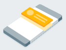
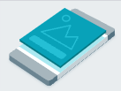
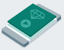
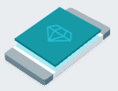

# 入门指南

将AdMob插件集成到您的Godot 3项目中，可以轻松地在Android和iOS设备上展示Google移动广告。

---

## 前提条件

- **Godot Engine 3.x Mono/Standard Edition**（v3.3或更高版本）。
- **Android导出**：
  - 启用Godot Android构建模板。
  - 配置目标Android SDK版本。
- **iOS导出**：
  - 安装了Xcode的macOS机器。
  - 活跃的Apple Developer账户。
- **建议**：拥有已注册Android/iOS应用的活跃[AdMob账户](https://admob.google.com/)。

---

## 下载并导入插件

1. 从[GitHub Releases](https://github.com/poingstudios/godot-admob-plugin/releases)页面下载最新版本。
2. 解压文件并将`addons/admob`文件夹复制到Godot项目的`res://addons/`目录。
3. 打开Godot编辑器，导航到**项目 -> 项目设置 -> 插件**，将**AdMob**插件状态切换为**已启用**。

启用后，插件会自动将`MobileAds`单例注册到您的项目中。

---

## 下载平台模板

在Godot编辑器内打开AdMob管理器（**项目 -> 工具 -> AdMob管理器**或点击**AdMob**面板标签）。

* **Android**：选择**下载Android模板**。插件将自动下载所需的模板文件（`.aar` 和 `.gdap`）并解压到您的 `res://android/plugins/` 文件夹中（无需手动解压 zip 压缩包）。
* **iOS**：选择**下载iOS模板**。插件将自动下载所需的模板文件（`.gdip` 和库文件）并解压到您的 `res://ios/plugins/` 文件夹中（无需手动解压 zip 压缩包）。

---

## 配置

在 **AdMob 编辑器面板**（`项目 -> 工具 -> AdMob 管理器`）中，配置以下选项：

| 选项 | 说明 |
|------|------|
| **App ID** | 您的 AdMob 应用 ID（例如 `ca-app-pub-3940256099942544~1458002511`）。 |
| **Ad Unit IDs** | 您计划使用的每种广告格式的 ID（横幅、插页、激励、激励插页）。 |
| **Is Enabled** | 全局启用或禁用广告。 |
| **Banner Position** | 选择横幅显示位置（顶部、底部、自定义）。 |
| **Banner Size** | 选择横幅尺寸（横幅、大横幅、中矩形等）。 |

---

## 初始化SDK

在加载广告之前，必须初始化Google Mobile Ads SDK。如果配置中**已启用**处于活动状态，插件将在启动时自动初始化。

如果您希望手动初始化或监控完成情况，请连接到`initialization_complete`信号：

=== "GDScript"

    ```gdscript
    func _ready() -> void:
        MobileAds.connect("initialization_complete", self, "_on_AdMob_initialization_complete")
        MobileAds.initialize()

    func _on_AdMob_initialization_complete(status: int, adapter_name: String) -> void:
        print("AdMob Initialized: ", status)
    ```

=== "C#"

    ```csharp
    public override void _Ready()
    {
        MobileAds.Connect("initialization_complete", this, nameof(_on_AdMob_initialization_complete));
        MobileAds.Call("initialize");
    }

    private void _on_AdMob_initialization_complete(int status, string adapterName)
    {
        GD.Print("AdMob Initialized: " + status);
    }
    ```

---

## 选择广告格式

Google Mobile Ads SDK 已成功导入，您可以开始将广告集成到您的应用中。AdMob 提供多种广告格式，您可以选择最适合您应用用户体验的格式。

### 横幅广告
<div class="image-text-container" markdown="1">



横幅广告是由图片或文字组成的矩形广告，集成在应用的布局中。在用户与应用互动时，它们会停留在屏幕上，并可按设定时间间隔自动刷新。

</div>

[实现横幅广告](ad_formats/banner.zh.md){ .md-button .md-button--primary }

### 插页广告
<div class="image-text-container" markdown="1">



插页广告是一种覆盖应用界面的全屏广告，在用户关闭前会一直显示。在应用运行的自然停顿点（如游戏关卡之间）放置效果最佳。

</div>

[实现插页广告](ad_formats/interstitial.zh.md){ .md-button .md-button--primary }

### 激励广告
<div class="image-text-container" markdown="1">



激励视频广告是一种沉浸式全屏视频广告，用户可选择完整观看。作为回报，用户将获得应用内奖励或福利。

</div>

[实现激励广告](ad_formats/rewarded.zh.md){ .md-button .md-button--primary }

### 激励插页广告
<div class="image-text-container" markdown="1">



激励插页广告是一种激励型广告格式，通过在应用自然过渡期间自动展示广告来提供奖励。

</div>

[实现激励插页广告](ad_formats/rewarded_interstitial.zh.md){ .md-button .md-button--primary }

<style>
  .image-text-container {
    display: flex;
    align-items: center;
  }
  .image-text-container img {
    margin-right: 20px;
    max-width: 130px;
    height: auto;
  }
</style>