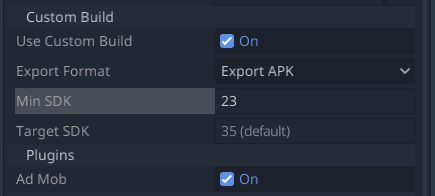

# 入门指南

!!! note "Godot 3 (v1) 文档"
    本文档适用于 **v1** 插件，仅支持 **Godot 3.x**。
    如需 **Godot 4.2+**，请查看[稳定文档](https://poingstudios.github.io/godot-admob-plugin/stable/)。

将AdMob插件集成到您的Godot 3项目中，可以轻松地在Android和iOS设备上展示Google移动广告。

---

## 前提条件

- **Godot Engine 3.x Mono/Standard Edition**（v3.3或更高版本）。
- **建议**：拥有已注册Android/iOS应用的活跃[AdMob账户](https://admob.google.com/)。

=== "Android"

    - 启用Godot Android构建模板。
    - 配置目标Android SDK版本。

=== "iOS"

    - 安装了Xcode的macOS机器。
    - 活跃的Apple Developer账户。

---

## 下载并导入插件

=== "资产库 (推荐)"

    1. 在 Godot 编辑器中打开您的项目，然后点击顶部的 **AssetLib** 标签页。
    2. 搜索 **AdMob**（作者为 `poing.studios`）。
    3. 点击 **下载**，然后点击 **安装** 将插件文件添加到您的项目中。
    4. 转到 **项目 -> 项目设置 -> 插件**，将 **AdMob** 插件的状态切换为 **启用**。

=== "GitHub Releases (手动)"

    1. 从 [GitHub Releases](https://github.com/poingstudios/godot-admob-plugin/releases) 页面下载最新版本。
    2. 解压压缩包并将 `addons/admob` 文件夹复制到 Godot 项目的 `res://addons/` 目录中。
    3. 打开 Godot 编辑器，转到 **项目 -> 项目设置 -> 插件**，将 **AdMob** 插件的状态切换为 **启用**。

启用后，插件会自动在您的项目中注册 `MobileAds` 自动加载单例。

---

## 下载平台模板

在Godot编辑器内打开AdMob管理器（**项目 -> 工具 -> AdMob管理器**或点击**AdMob**面板标签）。

=== "Android"

    选择**下载Android模板**。插件将自动下载所需的模板文件（`.aar` 和 `.gdap`）并解压到您的 `res://android/plugins/` 文件夹中（无需手动解压 zip 压缩包）。

=== "iOS"

    选择**下载iOS模板**。插件将自动下载所需的模板文件（`.gdip` 和库文件）并解压到您的 `res://ios/plugins/` 文件夹中（无需手动解压 zip 压缩包）。

---

## 配置

在 **AdMob 编辑器面板**（`项目 -> 工具 -> AdMob 管理器`）中，配置以下选项：


| 选项 | 标签页 | 说明 |
|------|--------|------|
| **Enabled** | General | 在编辑器中全局启用/禁用模拟广告及插件功能。 |
| **Child Directed Treatment** | General | 配置面向儿童的设置（COPPA）。 |
| **MaxAdContentRating** | General | 设置最高广告内容分级过滤（`G`, `PG`, `T`, `MA`）。 |
| **Banner Size** | Banner | 选择横幅尺寸（标准、大横幅、中矩形等）。 |
| **Position** | Banner | 选择横幅显示位置（顶部或底部）。 |
| **Show Instantly** | Banner | 加载后自动显示横幅。 |
| **Respect Safe Area** | Banner | 调整横幅位置以避开刘海屏/安全区域。 |

### 配置 App ID

在导出到真机之前，请为每个目标平台配置您的 [AdMob 应用 ID](https://support.google.com/admob/answer/7356431)（`ca-app-pub-XXXXXXXXXXXXXXXX~YYYYYYYYYY`）：

=== "Android"

    在 `res://android/build/AndroidManifest.xml` 的 `<application>` 标签内部添加包含 App ID 的 `<meta-data>` 标签：

    ```xml
    <!-- AdMob 应用 ID 示例: ca-app-pub-3940256099942544~3347511713 -->
    <meta-data
        tools:replace="android:value"
        android:name="com.google.android.gms.ads.APPLICATION_ID"
        android:value="ca-app-pub-xxxxxxxxxxxxxxxx~yyyyyyyyyy"/>
    ```

=== "iOS"

    您可以直接在 Godot 编辑器内部配置 AdMob 应用 ID，无需手动编辑配置文件：

    1. 通过 **项目 -> 导出...** 打开导出设置窗口。
    2. 选择您的 **iOS** 导出预设。
    3. 在 **选项** 标签页中，滚动至 **Plugins Plist** 部分。
    4. 将 **Gad Application Identifier** 字段设置为您的 AdMob 应用 ID（例如 `ca-app-pub-xxxxxxxxxxxxxxxx~yyyyyyyyyy`）。

    !!! tip "替代配置方式"
        您也可以直接在 `res://ios/plugins/admob.gdip` 的 `[plist]` 部分预先配置 `GADApplicationIdentifier="ca-app-pub-xxxxxxxxxxxxxxxx~yyyyyyyyyy"`。

---

## 导出项目

为移动平台构建游戏时，请在 **项目 -> 导出...** 中配置导出预设：

=== "Android"

    1. 选择（或添加）您的 **Android** 导出预设。
    2. 在 **选项** 标签页中：
       - 启用 **Custom Build** 下的 **Use Custom Build**（需要通过 **项目 -> 安装 Android 构建模板...** 安装构建模板）。
       - 将 **Min SDK** 设置为 `23`（Android 6.0）。
       - 启用 **Plugins** 下的 **Ad Mob**。
    3. 点击 **导出项目...** 生成您的 APK 或 AAB 文件。

    

=== "iOS"

    1. 选择（或添加）您的 **iOS** 导出预设。
    2. 在 **选项** 标签页中：
       - 启用 **Plugins** 下的 **Ad Mob**。
    3. 点击 **导出项目...** 生成您的 Xcode 项目。

---

## 初始化SDK

在加载广告之前，必须初始化Google Mobile Ads SDK。如果配置中**已启用**处于活动状态，插件将在启动时自动初始化。

如果您希望手动初始化或监控完成情况，请连接到`initialization_complete`信号：

=== "GDScript"

    ```gdscript
    func _ready() -> void:
        MobileAds.connect("initialization_complete", self, "_on_AdMob_initialization_complete")
        MobileAds.initialize()

    func _on_AdMob_initialization_complete(status: int, adapter_name: String) -> void:
        print("AdMob Initialized: ", status)
    ```

=== "C#"

    ```csharp
    public override void _Ready()
    {
        MobileAds.Connect("initialization_complete", this, nameof(_on_AdMob_initialization_complete));
        MobileAds.Call("initialize");
    }

    private void _on_AdMob_initialization_complete(int status, string adapterName)
    {
        GD.Print("AdMob Initialized: " + status);
    }
    ```

---

## 选择广告格式

Google Mobile Ads SDK 已成功导入，您可以开始将广告集成到您的应用中。AdMob 提供多种广告格式，您可以选择最适合您应用用户体验的格式。

### 横幅广告
<div class="image-text-container" markdown="1">


横幅广告是由图片或文字组成的矩形广告，集成在应用的布局中。在用户与应用互动时，它们会停留在屏幕上，并可按设定时间间隔自动刷新。

</div>

[实现横幅广告](ad_formats/banner.zh.md){ .md-button .md-button--primary }

### 插页广告
<div class="image-text-container" markdown="1">


插页广告是一种覆盖应用界面的全屏广告，在用户关闭前会一直显示。在应用运行的自然停顿点（如游戏关卡之间）放置效果最佳。

</div>

[实现插页广告](ad_formats/interstitial.zh.md){ .md-button .md-button--primary }

### 激励广告
<div class="image-text-container" markdown="1">


激励视频广告是一种沉浸式全屏视频广告，用户可选择完整观看。作为回报，用户将获得应用内奖励或福利。

</div>

[实现激励广告](ad_formats/rewarded.zh.md){ .md-button .md-button--primary }

### 激励插页广告
<div class="image-text-container" markdown="1">


激励插页广告是一种激励型广告格式，通过在应用自然过渡期间自动展示广告来提供奖励。

</div>

[实现激励插页广告](ad_formats/rewarded_interstitial.zh.md){ .md-button .md-button--primary }

<style>
  .image-text-container {
    display: flex;
    align-items: center;
  }
  .image-text-container img {
    margin-right: 20px;
    max-width: 130px;
    height: auto;
  }
</style>