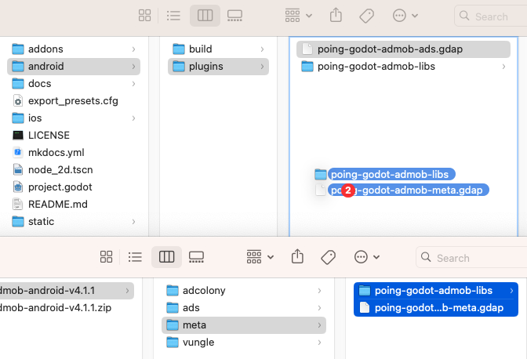
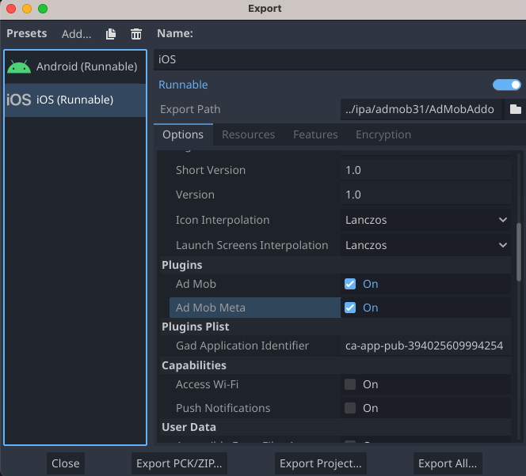

# Integre Meta Audience Network con las ofertas
!!! información
    
**Importante**: Facebook Audience Network ahora es Meta Audience Network. Ver[El anuncio de Meta.](https://about.fb.com/news/2021/10/facebook-company-is-now-meta/)para más información.
Esta guía explica cómo utilizar el SDK de anuncios de Google para móviles para cargar y presentar anuncios de Meta Audience Network a través de[mediación](../get_started.md), with a focus on bidding integrations. Proporciona instrucciones sobre cómo integrar Meta Audience Network en la configuración de mediación de una aplicación Godot e integrar el SDK y el adaptador de Meta Audience Network en su aplicación Godot.

Este documento se basa en:

- [Documentación de Android del SDK de anuncios de Google para móviles](https://developers.google.com/admob/android/mediation/meta)
- [Documentación de iOS del SDK de anuncios de Google para móviles](https://developers.google.com/admob/ios/mediation/meta)

## Integraciones y formatos de anuncios admitidos

El adaptador de mediación de AdMob para Meta Audience Network tiene las siguientes capacidades:

 | Integración |  | 
 | ------------- | --- | 
 | Ofertas | ✅ | 
 | Cascada [^1] | ❌ | 

 | Formatos |  | 
 | -------------- | --- | 
 | Bandera | ✅ | 
 | intersticial | ✅ | 
 | Recompensado | ✅ | 

[^1]: Meta Audience Network se convirtió[solo pujar](https://www.facebook.com/audiencenetwork/resources/blog/audience-network-to-become-bidding-only-beginning-with-ios-in-2021)en 2021.

## Requisitos previos
- Completa el[Guía de introducción](../../index.md)
- Completa la mediación[Guía de introducción](../get_started.md)

## Paso 1: configurar la red Meta Audience
Recomendamos seguir el tutorial para[Androide](https://developers.google.com/admob/android/mediation/meta#setup)o[iOS](https://developers.google.com/admob/ios/mediation/meta#setup), ya que será igual para ambos.

## Paso 2: Configure los ajustes de mediación para su bloque de anuncios de AdMob
Recomendamos seguir el tutorial para[Androide](https://developers.google.com/admob/android/mediation/meta#configure_mediation)o[iOS](https://developers.google.com/admob/ios/mediation/meta#configure_mediation), ya que será igual para ambos.

## Paso 3: importe el complemento Meta Audience Network

=== "Androide"
    1. Descargue el complemento para[Androide](https://github.com/poingstudios/godot-admob-android/releases/latest).
    2. Extraiga el archivo `.zip`. Dentro, encontrarás una carpeta `meta`.
    3. Copie el contenido de la carpeta `meta` y péguelo en la carpeta del complemento de Android en `res://addons/admob/android/bin/`.


=== "iOS"
El adaptador Meta Audience Network **ya está incluido** en la descarga del complemento estándar de iOS. Si seguiste el[Guía de instalación de iOS](../../index.md#download-install), ya debería tener los archivos necesarios (`poing-godot-admob-meta.gdip` y marcos relacionados) en su directorio `res://ios/plugins/`.

## Paso 4: habilite el complemento

=== "Androide"
Asegúrese de habilitar **Meta** en **Configuración del proyecto** (en `Admob > Android > Mediación > Meta`).

=== "iOS"
Asegúrese de marcar `Ad Mob` y `Ad Mob Meta` en la lista de complementos en sus **Preajustes de exportación de iOS** (además de ingresar el ID de su aplicación AdMob en la configuración de Plists).



## Paso 5: se requiere código adicional

=== "Androide"
No se requiere código adicional para la integración de Meta Audience Network.

=== "iOS"
**Integración SKAdNetwork**
Seguir[Documentación de Meta Audience Network](https://developers.facebook.com/docs/setting-up/platform-setup/ios/SKAdNetwork)para agregar los identificadores SKAdNetwork al archivo `Info.plist` de su proyecto.

    ---
    **Compile errors**

    You must follow the steps below to add Swift paths to your target's Build Settings to prevent compile errors.

    Add the following paths to the target's **Build Settings** under **Library Search Paths**:

    ```
    $(TOOLCHAIN_DIR)/usr/lib/swift/$(PLATFORM_NAME)
    $(SDKROOT)/usr/lib/swift
    ```

    Add the following path to the target's **Build Settings** under **Runpath Search Paths**:
    ```
    /usr/lib/swift
    ```

    Read more about: https://developers.google.com/admob/ios/mediation/meta#step_4_additional_code_required

    ---
**Seguimiento publicitario habilitado**
Si está compilando para iOS 14 o posterior, Meta Audience Network requiere que configure explícitamente su[Seguimiento de publicidad habilitado](https://developers.facebook.com/docs/audience-network/setting-up/platform-setup/ios/advertising-tracking-enabled)marcar usando el siguiente código:

!!! información
        
**Punto importante**: Debe configurar esta marca antes de inicializar el SDK de anuncios móviles.
=== "GDScript"

    ```gdscript
    if OS.get_name() == "iOS":
        #FBAdSettings is available only for iOS, Google didn't put this method on Android SDK
        FBAdSettings.set_advertiser_tracking_enabled(true)
    ```

=== "C#"

    ```csharp
    if (OS.GetName() == "iOS")
    {
        //FBAdSettings is available only for iOS, Google didn't put this method on Android SDK
        FBAdSettings.SetAdvertiserTrackingEnabled(true);
    }
    ```

## Paso 6: Pruebe su implementación
Recomendamos seguir el tutorial para[Androide](https://developers.google.com/admob/android/mediation/meta#step_5_test_your_implementation)o[iOS](https://developers.google.com/admob/ios/mediation/meta#step_5_test_your_implementation), ya que será igual para ambos.


## Pasos opcionales

!!! información
    
**Importante**: Verifique que tiene permiso de **Administración de cuentas** para completar la configuración de Consentimiento de la UE y GDPR, CCPA y Plataforma de mensajería de usuario. Para obtener más información, consulte lo siguiente.[nuevos roles de usuario](https://support.google.com/admob/answer/2784628)artículo.

### Consentimiento de la UE y RGPD
Bajo Google[Política de consentimiento del usuario de la UE](https://www.google.com/about/company/consentstaging.html), es obligatorio proporcionar ciertas divulgaciones y obtener consentimientos de los usuarios dentro del Espacio Económico Europeo (EEE) con respecto a la utilización de identificadores de dispositivos y datos personales. Esta política se alinea con la Directiva de privacidad electrónica de la UE y el Reglamento general de protección de datos (GDPR). Al solicitar el consentimiento, debe identificar explícitamente cada red publicitaria dentro de su cadena de mediación que pueda recopilar, recibir o utilizar datos personales. Además, debe proporcionar información sobre cómo cada red pretende utilizar estos datos. Es importante destacar que actualmente Google no puede transmitir automáticamente la elección de consentimiento del usuario a estas redes.

Por favor revise Meta's[guía](https://www.facebook.com/business/gdpr)para obtener información sobre GDPR y metapublicidad.

#### Agregue Facebook a la lista de socios publicitarios del RGPD
Siga los pasos en[Configuración del RGPD](https://support.google.com/admob/answer/10113004#adding_ad_partners_to_published_gdpr_messages)para agregar **Facebook** a la lista de socios publicitarios del RGPD en la interfaz de usuario de AdMob.


### CCPA
El[Ley de Privacidad del Consumidor de California (CCPA)](https://support.google.com/admob/answer/9561022)exige que los residentes del estado de California tengan derecho a optar por no participar en la "venta" de su "información personal", según lo define la ley. Esta opción de exclusión voluntaria debe mostrarse de manera destacada a través del enlace "No vender mi información personal" en la página de inicio de la parte que realiza la venta.

El[preparación de la CCPA](../../privacy/regulatory_solutions/us_states_privacy_laws.md)La guía ofrece una función para permitir[procesamiento de datos restringido](https://privacy.google.com/businesses/rdp/)para la publicación de anuncios de Google. Sin embargo, Google no puede aplicar esta configuración a todas las redes publicitarias dentro de su cadena de mediación. Por lo tanto, es esencial identificar cada red publicitaria en su cadena de mediación que podría estar involucrada en la venta de información personal y seguir la guía específica proporcionada por cada una de esas redes para garantizar el cumplimiento de la CCPA.

Por favor revise Meta's[documentación](https://developers.facebook.com/docs/marketing-apis/data-processing-options)para opciones de procesamiento de datos para usuarios en California.

#### Agregue Facebook a la lista de socios publicitarios de CCPA
Siga los pasos en[Configuración CCPA](https://support.google.com/admob/answer/10860309)para agregar **Facebook** a la lista de socios publicitarios CCPA en la interfaz de usuario de AdMob.

### Almacenamiento en caché
=== "Androide"
**Android 9**:
A partir de Android 9 (nivel de API 28),[La compatibilidad con texto sin cifrar está deshabilitada de forma predeterminada.](https://developer.android.com/training/articles/security-config#CleartextTrafficPermitted), lo que afectará la funcionalidad del almacenamiento en caché de medios del SDK de Meta Audience Network y podría afectar la experiencia del usuario y los ingresos por publicidad. Seguir[documentación de meta](https://developers.facebook.com/docs/audience-network/android-network-security-config/)para actualizar la configuración de seguridad de red en su aplicación.

=== "iOS"
No aplicable.

## Códigos de error
Si el adaptador no puede recibir un anuncio de Audience Network, los editores pueden verificar el error subyacente de la respuesta del anuncio usando `ResponseInfo` en las siguientes clases:

=== "Androide"
    ```
    com.google.ads.mediation.facebook.FacebookAdapter
    com.google.ads.mediation.facebook.FacebookMediationAdapter
    ```

=== "iOS"
    ```
    GADMAdapterFacebook
    GADMediationAdapterFacebook
    ```

Estos son los códigos y los mensajes adjuntos que genera el adaptador de Meta Audience Network cuando un anuncio no se carga:

=== "Androide"
 | código de error | Razón | 
 | ------------ | ---------------------------------------------------------------------------------------------------------- | 
 | 101 | Parámetros del servidor no válidos (por ejemplo, falta el ID de ubicación). | 
 | 102 | El tamaño de anuncio solicitado no coincide con el tamaño de banner admitido por Meta Audience Network. | 
 | 103 | El editor debe solicitar anuncios con un contexto de **Actividad**. | 
 | 104 | El SDK de Meta Audience Network no se pudo inicializar. | 
 | 105 | El editor no solicitó anuncios nativos unificados. | 
 | 106 | El anuncio nativo cargado es un objeto diferente al esperado. | 
 | 107 | El objeto **Context** utilizado no es válido. | 
 | 108 | Al anuncio cargado le faltan los recursos publicitarios nativos necesarios. | 
 | 109 | No se pudo crear un anuncio nativo a partir de la carga útil de la oferta. | 
 | 110 | El SDK de Meta Audience Network no pudo presentar su anuncio intersticial/recompensado. | 
 | 111 | Se produce una excepción al crear un objeto **AdView** de Meta Audience Network. | 
 | 1000-9999 | Meta Audience Network devolvió un error específico del SDK. Ver Meta Audience Network[documentación](https://developers.facebook.com/docs/audience-network/setting-up/test/checklist-errors)para más detalles. | 

=== "iOS"
 | código de error | Razón | 
 | ------------ | ----------------------------------------------------------------------------------------------------------------------- | 
 | 101 | Parámetros del servidor no válidos (por ejemplo, falta el ID de ubicación). | 
 | 102 | El tamaño de anuncio solicitado no coincide con el tamaño de banner admitido por Meta Audience Network. | 
 | 103 | El objeto publicitario de Meta Audience Network no pudo inicializarse. | 
 | 104 | El SDK de Meta Audience Network no pudo presentar su anuncio intersticial/recompensado. | 
 | 105 | El controlador de vista raíz del anuncio de banner es **nulo**. | 
 | 106 | El SDK de Meta Audience Network no se pudo inicializar. | 
 | 1000-9999 | Meta Audience Network devolvió un error específico del SDK. Ver Meta Audience Network[documentación](https://developers.facebook.com/docs/audience-network/setting-up/test/checklist-errors)para más detalles. | 
