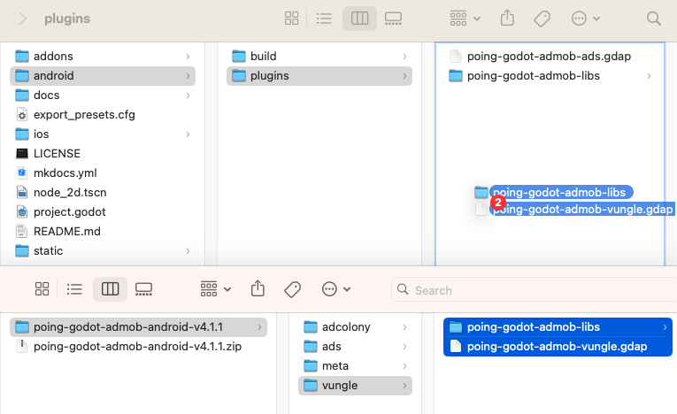
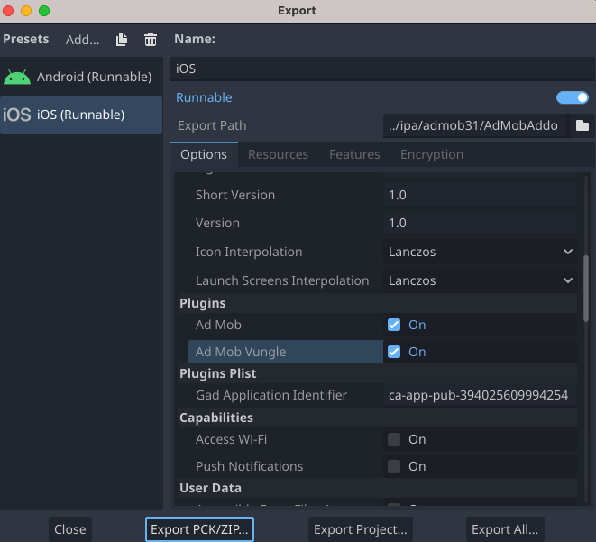

# Integrar Liftoff Monetize (Vungle) con mediación
!!! información
    
**Nota**: Vungle ahora es Liftoff Monetize.
Esta guía explica cómo utilizar el SDK de anuncios de Google para móviles para cargar y presentar anuncios de Liftoff Monetize a través de[mediación](../get_started.md), con una cobertura integral de integraciones de ofertas y en cascada. Proporciona instrucciones sobre cómo integrar Liftoff Monetize en la configuración de mediación de una aplicación Godot e integrar el SDK y el adaptador de Vungle en su aplicación Godot.

Este documento se basa en:

- [Documentación de Android del SDK de anuncios de Google para móviles](https://developers.google.com/admob/android/mediation/liftoff-monetize)
- [Documentación de iOS del SDK de anuncios de Google para móviles](https://developers.google.com/admob/ios/mediation/liftoff-monetize)

## Integraciones y formatos de anuncios admitidos

El adaptador de mediación de AdMob para Vungle tiene las siguientes capacidades:

 | Integración |  | 
 | ------------- | --- | 
 | Ofertas | ✅ | 
 | Cascada | ✅ | 

 | Formatos |  | 
 | ----------------------- | ------------ | 
 | Bandera | [^1] | 
 | intersticial | ✅ | 
 | Recompensado | ✅ | 
 | Intersticial recompensado | [^1], [^2] | 

[^1]: no se admite en las ofertas (se admite solo para la mediación en cascada).
[^2]: Para acceder a esta función, comuníquese con su administrador de cuenta de Liftoff Monetize.

## Requisitos previos
- Completa el[Guía de introducción](../../index.md)
- Completa la mediación[Guía de introducción](../get_started.md)


## Limitaciones

- Liftoff Monetize no admite la carga de varios anuncios utilizando el mismo ID de referencia de ubicación.
    - El adaptador Vungle falla con gracia en la segunda solicitud si se está cargando o esperando a mostrarse otra solicitud para esa ubicación.
- Liftoff Monetize solo admite la carga de 1 anuncio publicitario a la vez.
    - El adaptador Vungle falla con gracia en las solicitudes de banner posteriores si ya hay un anuncio de banner cargado.

## Paso 1: Configurar Liftoff Monetize
Recomendamos seguir el tutorial para[Androide](https://developers.google.com/admob/android/mediation/liftoff-monetize#step_1_set_up_liftoff_monetize)o[iOS](https://developers.google.com/admob/ios/mediation/liftoff-monetize#step_1_set_up_liftoff_monetize), ya que será igual para ambos.

## Paso 2: Configure los ajustes de mediación para su bloque de anuncios de AdMob
Recomendamos seguir el tutorial para[Androide](https://developers.google.com/admob/android/mediation/liftoff-monetize#step_2)o[iOS](https://developers.google.com/admob/ios/mediation/liftoff-monetize#step_2), ya que será igual para ambos.

## Paso 3: importe el complemento Vungle SDK

=== "Androide"
    1. Descargue el complemento para[Androide](https://github.com/poingstudios/godot-admob-android/releases/latest).
    2. Extraiga el archivo `.zip`. Dentro encontrarás una carpeta `vungle`.
    3. Copie el contenido de la carpeta `vungle` y péguelo en la carpeta del complemento de Android en `res://addons/admob/android/bin/`.


=== "iOS"
El adaptador Liftoff Monetize (Vungle) **ya está incluido** en la descarga del complemento estándar de iOS. Si seguiste el[Guía de instalación de iOS](../../index.md#download-install), ya debería tener los archivos necesarios (`poing-godot-admob-vungle.gdip` y marcos relacionados) en su directorio `res://ios/plugins/`.

## Paso 4: habilite el complemento

=== "Androide"
Asegúrese de habilitar **Vungle** en **Configuración del proyecto** (en `Admob > Android > Mediación > Vungle`).

=== "iOS"
Asegúrese de marcar `Ad Mob` y `Ad Mob vungle` en la lista de complementos en sus **Preajustes de exportación de iOS** (además de ingresar el ID de su aplicación AdMob en la configuración de Plists).



## Paso 5: se requiere código adicional

Liftoff Monetize necesita una lista de todas las ubicaciones que se emplearán en su aplicación Godot para transmitirlas a su SDK. Puede proporcionar esta lista de ubicaciones al adaptador utilizando las clases `VungleInterstitialMediationExtras` y `VungleRewardedVideoMediationExtras`. Los ejemplos de código siguientes ilustran cómo emplear estas clases.

=== "Intersticial"

=== "GDScript"
    
        ```gdscript
        var vungle_mediation_extras := VungleInterstitialMediationExtras.new()
    
        if OS.get_name() == "iOS":
            vungle_mediation_extras.all_placements = ["ios_placement1", "ios_placement2"]
        elif OS.get_name() == "Android":
            vungle_mediation_extras.all_placements = ["android_placement1", "android_placement2"]
    
        var ad_request := AdRequest.new()
        ad_request.mediation_extras.append(vungle_mediation_extras)
        ```
    
=== "C#"
    
        ```csharp
        var vungleMediationExtras = new VungleInterstitialMediationExtras();
        
        if (OS.GetName() == "iOS")
        {
            vungleMediationExtras.AllPlacements = new string[] { "ios_placement1", "ios_placement2" };
        }
        else if (OS.GetName() == "Android")
        {
            vungleMediationExtras.AllPlacements = new string[] { "android_placement1", "android_placement2" };
        }
        
        var adRequest = new AdRequest();
        adRequest.MediationExtras.Add(vungleMediationExtras);
        ```
=== "Recompensado"

=== "GDScript"
    
        ```gdscript
    	var vungle_mediation_extras := VungleRewardedMediationExtras.new()
    	
    	if OS.get_name() == "iOS":
    		vungle_mediation_extras.all_placements = ["ios_placement1", "ios_placement2"]
    	elif OS.get_name() == "Android":
    		vungle_mediation_extras.all_placements = ["android_placement1", "android_placement2"]
    	
    	var ad_request := AdRequest.new()
    	ad_request.mediation_extras.append(vungle_mediation_extras)
        ```
    
=== "C#"
    
        ```csharp
        var vungleMediationExtras = new VungleRewardedMediationExtras();
        
        if (OS.GetName() == "iOS")
        {
            vungleMediationExtras.AllPlacements = new string[] { "ios_placement1", "ios_placement2" };
        }
        else if (OS.GetName() == "Android")
        {
            vungleMediationExtras.AllPlacements = new string[] { "android_placement1", "android_placement2" };
        }
        
        var adRequest = new AdRequest();
        adRequest.MediationExtras.Add(vungleMediationExtras);
        ```

---

=== "Android"
    No additional code is required for Liftoff Monetize integration.

=== "iOS"
    **SKAdNetwork integration**

    Follow [Liftoff Monetize's documentation](https://support.vungle.com/hc/en-us/articles/360002925791-Integrate-Vungle-SDK-for-iOS#h_01EM0AZYJ84W7CWZHW4KRHQHXF) to add the SKAdNetwork identifiers to your project's `Info.plist` file.

## Step 6: Test your implementation
We recommend following the tutorial for [Android](https://developers.google.com/admob/android/mediation/liftoff-monetize#step_5_test_your_implementation) or [iOS](https://developers.google.com/admob/ios/mediation/liftoff-monetize#step_5_test_your_implementation), as it will be the same for both.

## Optional steps

!!! info
    
    **Important**: Please verify you have **Account Management** permission to complete configuration for EU Consent and GDPR, CCPA, and User Messaging Platform. To learn more please see the following [new user roles](https://support.google.com/admob/answer/2784628) article.


### EU consent and GDPR
Under the Google [EU User Consent Policy](https://www.google.com/about/company/consentstaging.html), it's mandatory to provide certain disclosures and obtain consents from users within the European Economic Area (EEA) regarding the utilization of device identifiers and personal data. This policy aligns with the EU ePrivacy Directive and the General Data Protection Regulation (GDPR). When seeking consent, you must explicitly identify each ad network within your mediation chain that may collect, receive, or utilize personal data. Additionally, you should furnish information about how each network intends to use this data. Importantly, Google currently cannot automatically transmit the user's consent choice to these networks.

The following sample code shows how to pass this consent information to the Vungle SDK. If you choose to call this method, it is recommended that you do so prior to requesting ads through the Google Mobile Ads SDK.

=== "GDScript"

    ```gdscript
    Vungle.update_consent_status(Vungle.Consent.OPTED_IN, "1.0.0")
    ```

=== "C#"

    ```csharp
    Vungle.UpdateConsentStatus(Vungle.Consent.OptedIn, "1.0.0");
    ```

See [GDPR recommended implementation instructions](https://support.vungle.com/hc/en-us/articles/360047780372#gdpr-recommended-implementation-instructions-0-1) for more details and the values that can be provided in the method.

#### Add Liftoff to GDPR ad partners list
Follow the steps in [GDPR settings](https://support.google.com/admob/answer/10113004#adding_ad_partners_to_published_gdpr_messages) to add Liftoff to the GDPR ad partners list in the AdMob UI.

### CCPA
The [California Consumer Privacy Act (CCPA)](https://support.google.com/admob/answer/9561022) mandates that California state residents have the right to opt out of the "sale" of their "personal information," as defined by the law. This opt-out option should be prominently displayed through a "Do Not Sell My Personal Information" link on the homepage of the party engaging in the sale.

The [CCPA preparation](../../privacy/regulatory_solutions/us_states_privacy_laws.md) guide offers a feature to enable [restricted data processing](https://privacy.google.com/businesses/rdp/) for Google ad serving. However, Google cannot apply this setting to every ad network within your mediation chain. Therefore, it is essential to identify each ad network in your mediation chain that might be involved in the sale of personal information and follow the specific guidance provided by each of those networks to ensure CCPA compliance.

The following sample code shows how to pass this consent information to the Vungle SDK. If you choose to call this method, it is recommended that you do so prior to requesting ads through the Google Mobile Ads SDK.

=== "GDScript"

    ```gdscript
    Vungle.update_ccpa_status(Vungle.Consent.OPTED_IN)
    ```

=== "C#"

    ```csharp
    Vungle.UpdateCcpaStatus(Vungle.Consent.OptedIn);
    ```

#### Add Liftoff to CCPA ad partners list
Follow the steps in [CCPA settings](https://support.google.com/admob/answer/10860309) to add Liftoff to the CCPA ad partners list in the AdMob UI.

### Network-specific parameters
The Vungle adapter for Godot supports an additional request parameter that can be conveyed to the adapter using either the `VungleRewardedMediationExtras` or `VungleInterstitialMediationExtras` class, depending on the ad format you are implementing. These classes include the following properties:

- `sound_enabled`: Determines whether sound should be enabled when playing video ads.

- `user_id`: A string representing the Incentivized User ID for Godot's Liftoff Monetize integration.

- `all_placements`: An array comprising all Placement IDs within the app (this is not required for apps employing Vungle SDK 6.2.0 or higher).

For iOS, you can simply use the `VungleAdNetworkExtras` class.

Here's a code example of how to create an ad request that sets these parameters:

=== "Interstitial"

    === "GDScript"
    
        ```gdscript
    	var vungle_mediation_extras := VungleInterstitialMediationExtras.new()
    	
    	if OS.get_name() == "iOS":
    		vungle_mediation_extras.all_placements = ["ios_placement1", "ios_placement2"]
    		vungle_mediation_extras.sound_enabled = true
    		vungle_mediation_extras.user_id = "ios_user_id"
    	elif OS.get_name() == "Android":
    		vungle_mediation_extras.all_placements = ["android_placement1", "android_placement2"]
    		vungle_mediation_extras.sound_enabled = true
    		vungle_mediation_extras.user_id = "android_user_id"
    	
    	var ad_request := AdRequest.new()
    	ad_request.mediation_extras.append(vungle_mediation_extras)
        ```
    
    === "C#"
    
        ```csharp
        var vungleMediationExtras = new VungleInterstitialMediationExtras();
        
        if (OS.GetName() == "iOS")
        {
            vungleMediationExtras.AllPlacements = new string[] { "ios_placement1", "ios_placement2" };
            vungleMediationExtras.SoundEnabled = true;
            vungleMediationExtras.UserId = "ios_user_id";
        }
        else if (OS.GetName() == "Android")
        {
            vungleMediationExtras.AllPlacements = new string[] { "android_placement1", "android_placement2" };
            vungleMediationExtras.SoundEnabled = true;
            vungleMediationExtras.UserId = "android_user_id";
        }
        
        var adRequest = new AdRequest();
        adRequest.MediationExtras.Add(vungleMediationExtras);
        ```
=== "Rewarded"

    === "GDScript"
    
        ```gdscript
        var vungle_mediation_extras := VungleRewardedMediationExtras.new()
    
        if OS.get_name() == "iOS":
            vungle_mediation_extras.all_placements = ["ios_placement1", "ios_placement2"]
            vungle_mediation_extras.sound_enabled = true
            vungle_mediation_extras.user_id = "ios_user_id"
        elif OS.get_name() == "Android":
            vungle_mediation_extras.all_placements = ["android_placement1", "android_placement2"]
            vungle_mediation_extras.sound_enabled = true
            vungle_mediation_extras.user_id = "android_user_id"
    
        var ad_request := AdRequest.new()
        ad_request.mediation_extras.append(vungle_mediation_extras)
        ```
    
    === "C#"
    
        ```csharp
        var vungleMediationExtras = new VungleRewardedMediationExtras();
        
        if (OS.GetName() == "iOS")
        {
            vungleMediationExtras.AllPlacements = new string[] { "ios_placement1", "ios_placement2" };
            vungleMediationExtras.SoundEnabled = true;
            vungleMediationExtras.UserId = "ios_user_id";
        }
        else if (OS.GetName() == "Android")
        {
            vungleMediationExtras.AllPlacements = new string[] { "android_placement1", "android_placement2" };
            vungleMediationExtras.SoundEnabled = true;
            vungleMediationExtras.UserId = "android_user_id";
        }
        
        var adRequest = new AdRequest();
        adRequest.MediationExtras.Add(vungleMediationExtras);
        ```


## Error codes
If the adapter fails to receive an ad from Audience Network, publishers can check the underlying error from the ad response using `ResponseInfo` under the following classes:

=== "Android"
    | Format       | Class name                                     |
    |--------------|------------------------------------------------|
    | Banner       | com.vungle.mediation.VungleInterstitialAdapter |
    | Interstitial | com.vungle.mediation.VungleInterstitialAdapter |
    | Rewarded     | com.vungle.mediation.VungleAdapter             |

=== "iOS"
    | Format       | Class name                          |
    |--------------|-------------------------------------|
    | Banner       | GADMAdapterVungleInterstitial       |
    | Interstitial | GADMAdapterVungleInterstitial       |
    | Rewarded     | GADMAdapterVungleRewardBasedVideoAd |

Here are the codes and accompanying messages thrown by the Liftoff Monetize adapter when an ad fails to load:

=== "Android"
    | Error code | Domain                          | Reason                                                                                                         |
    |------------|---------------------------------|----------------------------------------------------------------------------------------------------------------|
    | 0-100      | com.vungle.warren               | Vungle SDK returned an error. See [document](https://support.vungle.com/hc/en-us/articles/360047780372-Advanced-Settings#exception-codes-for-debugging-0-9) for more details. |
    | 101        | com.google.ads.mediation.vungle | Invalid server parameters (e.g. app ID or placement ID).                                                       |
    | 102        | com.google.ads.mediation.vungle | The requested banner size does not map to a valid Liftoff Monetize ad size.                                    |
    | 103        | com.google.ads.mediation.vungle | Liftoff Monetize requires an Activity context to request ads.                                                  |
    | 104        | com.google.ads.mediation.vungle | The Vungle SDK cannot load multiple ads for the same placement ID.                                             |
    | 105        | com.google.ads.mediation.vungle | The Vungle SDK failed to initialize.                                                                           |
    | 106        | com.google.ads.mediation.vungle | Vungle SDK returned a successful load callback, but Banners.getBanner() or Vungle.getNativeAd() returned null. |
    | 107        | com.google.ads.mediation.vungle | Vungle SDK is not ready to play the ad.                                                                        |

=== "iOS"
    | Error code | Domain                      | Reason                                                                                                                |
    |------------|-----------------------------|-----------------------------------------------------------------------------------------------------------------------|
    | 1-100      | Sent by Vungle SDK          | Vungle SDK returned an error. See [code](https://github.com/Vungle/iOS-SDK/blob/6.12.0/VungleSDK.xcframework/ios-arm64_armv7/VungleSDK.framework/Headers/VungleSDK.h) for more details. |
    | 101        | com.google.mediation.vungle | Liftoff Monetize server parameters configured in the AdMob UI are missing/invalid.                                    |
    | 102        | com.google.mediation.vungle | An ad is already loaded for this network configuration. Vungle SDK cannot load a second ad for the same placement ID. |
    | 103        | com.google.mediation.vungle | The requested ad size does not match a Liftoff Monetize supported banner size.                                        |
    | 104        | com.google.mediation.vungle | Vungle SDK could not render the banner ad.                                                                            |
    | 105        | com.google.mediation.vungle | Vungle SDK only supports loading 1 banner ad at a time, regardless of placement ID.                                   |
    | 106        | com.google.mediation.vungle | Vungle SDK sent a callback saying the ad is not playable.                                                             |