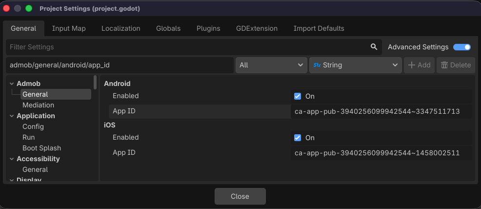
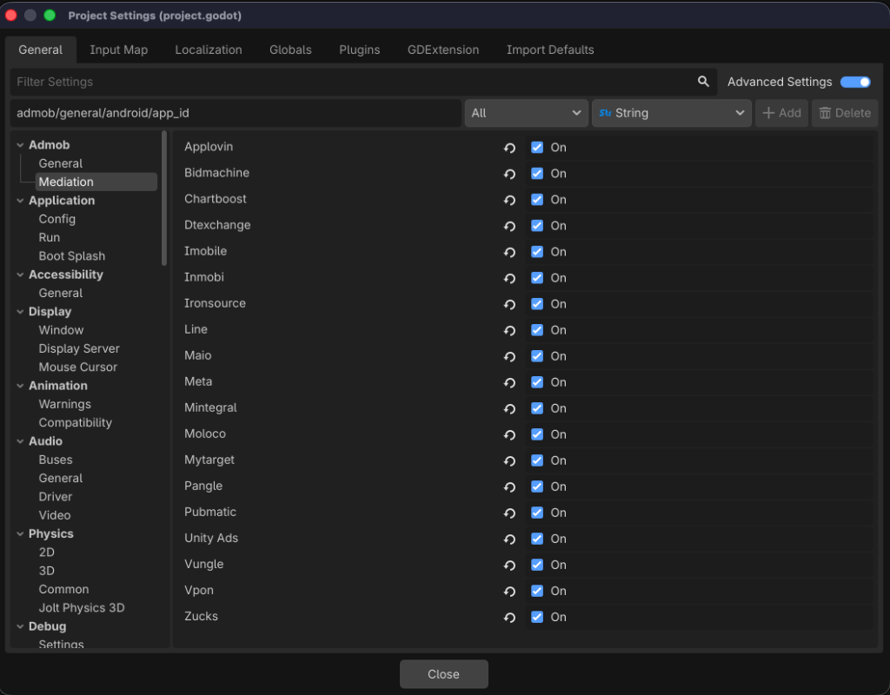

# SDK バージョンの移行

このページでは、Godot AdMob エディタープラグインの現在および以前のバージョンの移行について説明します。

## v4 から v5 への移行

以下のサブセクションでは、Godot AdMob エディタープラグインのメジャーバージョン 4 と 5 の間の破壊的変更、動作の違い、および新規 API について説明します。

### Next-Gen Android SDK への移行

バージョン 5.0.0 では、アンダーラインの Android ネイティブプラグインの依存関係が、従来の Google Mobile Ads SDK から最新の Google Mobile Ads Next-Gen SDK に移行されました。

* **旧依存関係 (v4):** `com.google.android.gms:play-services-ads`
* **新依存関係 (v5):** `com.google.android.libraries.ads.mobile.sdk:ads-mobile-sdk`

!!! danger "メディエーションの競合"
    一部の古いサードパーティ製メディエーションアダプターが推移的に古い `play-services-ads` または `play-services-ads-lite` ライブラリを引き込む可能性があるため、Android ビルドのコンパイル時にクラスやシンボルの重複エラーが発生する場合があります。

#### 自動修正について
バージョン 5.0.0 の Godot エクスポートハンドラーは、Android のエクスポートプロセスを自動的にインターセプトし、プロジェクトの Gradle ファイル (`res://android/build/build.gradle` または `res://android/build/app/build.gradle`) を修正して、従来の依存関係を明示的に除外します。

```groovy
// GMA Next-Gen SDK をサポートするために Poing Godot AdMob プラグインによって自動的に追加されました
configurations.configureEach {
    exclude group: "com.google.android.gms", module: "play-services-ads"
    exclude group: "com.google.android.gms", module: "play-services-ads-lite"
}
```
手動での介入や設定は不要です。

---

### スマートバナーの削除

レガシーな `スマートバナー` フォーマットは Google によって非推奨となり、v5 でプラグインから完全に削除されました。

| 言語 | 削除されたサイズ API | 代替手段 |
| :--- | :--- | :--- |
| **GDScript** | `AdSize.get_smart_banner_ad_size()` | [`AdSize.get_current_orientation_anchored_adaptive_banner_ad_size(width)`](reference/classes/AdSize.md) |
| **C#** | `AdSize.GetSmartBannerAdSize()` | [`AdSize.GetCurrentOrientationAnchoredAdaptiveBannerAdSize(width)`](reference/classes/AdSize.md) |

!!! note "後方互換性のフォールバック"
    安全のため、Android と iOS の両方のネイティブプラグインが自動的なフォールバックを実装しています。古いシーンやレイアウトが引き続き幅 `-1` ・高さ `-1` のサイズを送信した場合、ネイティブブリッジがそれをインターセプトし、画面幅に一致する標準のアンカー付きアダプティブバナーサイズを返します。

#### 移行方法
代わりに**アンカー付きアダプティブバナー**を使用してください。これらは公式のモダンな代替手段であり、デバイスの幅と画面密度に基づいて最適な高さを動的に計算します。

=== "v4"

    === "GDScript"

        ```gdscript
        # レガシーなスマートバナー
        var ad_view := AdView.new(unit_id, AdSize.get_smart_banner_ad_size(), AdPosition.Values.TOP)
        ```

    === "C#"

        ```csharp
        // レガシーなスマートバナー
        var adView = new AdView(unitId, AdSize.GetSmartBannerAdSize(), AdPosition.Values.Top);
        ```

=== "v5"

    === "GDScript"

        ```gdscript
        # 全幅に一致するアダプティブバナー
        var ad_size := AdSize.get_current_orientation_anchored_adaptive_banner_ad_size(AdSize.FULL_WIDTH)
        var ad_view := AdView.new(unit_id, ad_size, AdPosition.TOP)
        ```

    === "C#"

        ```csharp
        // 全幅に一致するアダプティブバナー
        var adSize = AdSize.GetCurrentOrientationAnchoredAdaptiveBannerAdSize(AdSize.FullWidth);
        var adView = new AdView(unitId, adSize, AdPosition.Top);
        ```

---

### AdPosition API の変更 (破壊的変更)

バージョン 5.0.0 では、[`AdPosition`](reference/classes/AdPosition.md) API が基本的な整数 enum からクラスインスタンスに変更されました。これにより、事前定義された静的座標またはカスタムピクセルオフセットのいずれかを使用してバナー広告を配置できるようになります。

| v4 API (非推奨) | v5 API (代替手段) |
| :--- | :--- |
| `AdPosition.Values.TOP` | `AdPosition.TOP` |
| `AdPosition.Values.BOTTOM` | `AdPosition.BOTTOM` |
| `AdPosition.Values.LEFT` | `AdPosition.LEFT` |
| `AdPosition.Values.RIGHT` | `AdPosition.RIGHT` |
| `AdPosition.Values.TOP_LEFT` | `AdPosition.TOP_LEFT` |
| `AdPosition.Values.TOP_RIGHT` | `AdPosition.TOP_RIGHT` |
| `AdPosition.Values.BOTTOM_LEFT` | `AdPosition.BOTTOM_LEFT` |
| `AdPosition.Values.BOTTOM_RIGHT` | `AdPosition.BOTTOM_RIGHT` |
| `AdPosition.Values.CENTER` | `AdPosition.CENTER` |
| カスタム配置の非サポート | `AdPosition.custom(x, y)` |

#### 移行方法
バナー作成および位置更新の際は、生の enum 値ではなく、[`AdPosition`](reference/classes/AdPosition.md) クラスのインスタンスを渡すように更新してください。

=== "v4"

    === "GDScript"

        ```gdscript
        var ad_view := AdView.new(unit_id, ad_size, AdPosition.Values.TOP)
        ```

    === "C#"

        ```csharp
        var adView = new AdView(unitId, adSize, AdPosition.Values.Top);
        ```

=== "v5"

    === "GDScript"

        ```gdscript
        # 事前定義された位置
        var ad_view := AdView.new(unit_id, ad_size, AdPosition.TOP)
        
        # カスタム座標 (例: x=0, y=100)
        var custom_ad_view := AdView.new(unit_id, ad_size, AdPosition.custom(0, 100))
        ```

    === "C#"

        ```csharp
        // 事前定義された位置
        var adView = new AdView(unitId, adSize, AdPosition.Top);

        // カスタム座標 (例: x=0, y=100)
        var customAdView = new AdView(unitId, adSize, AdPosition.Custom(0, 100));
        ```

---

### メディエーションエコシステムの変更

メディエーションエコシステムが整理および更新されました。非推奨となったメディエーションパートナーが削除され、新しくいくつかのネットワークがサポートされました。

#### 削除されたメディエーションネットワーク
非推奨化に伴い、以下のレガシーなメディエーションアダプターが削除されました。

* AdColony

#### 追加されたメディエーションネットワーク
以下のメディエーションネットワークのサポートが追加されました。

* AppLovin
* BidMachine
* Chartboost
* DT Exchange
* i-mobile
* InMobi
* IronSource
* LINE
* Unity Ads

---

### 新しい広告フォーマット

バージョン 5.0.0 では、次の 2 つの新しい広告フォーマットに対するサポートが追加されました。

1. **アプリ起動時広告 (App Open Ads):** アプリのロード時や復帰時に表示される広告です。[`AppOpenAdLoader`](reference/classes/AppOpenAdLoader.md) を使用してロードし、[`AppOpenAd`](reference/classes/AppOpenAd.md) を使用して制御します。
2. **ネイティブ重ね合わせ広告 (Native Overlay Ads):** ネイティブテンプレート（Small または Medium レイアウト）とスタイル設定（[`NativeTemplateStyle`](reference/classes/NativeTemplateStyle.md), [`NativeAdOptions`](reference/classes/NativeAdOptions.md)）を使用して、ゲーム上にカスタマイズ可能なネイティブ広告を直接レンダリングします。

---

### 新しいグローバル設定とプライバシー機能

[`MobileAds`](reference/classes/MobileAds.md) クラスおよび [`UserMessagingPlatform`](reference/classes/UserMessagingPlatform.md) に、同意、プライバシーコンプライアンス、およびデバッグ用のいくつかの新しい API メソッドが追加されました。

* **広告インスペクター (Ad Inspector):** [`MobileAds`](reference/classes/MobileAds.md).`open_ad_inspector(ad_inspector_closed_listener)` を介して広告インスペクターを開きます。
* **ファーストパーティ ID オプション:** [`MobileAds`](reference/classes/MobileAds.md).`set_publisher_first_party_id_enabled(enabled)` を使用してパブリッシャーのファーストパーティ ID 設定の有効/無効を切り替えます。
* **同意 Cookie 設定:** SDK が Cookie の同意を得ているかを [`MobileAds`](reference/classes/MobileAds.md).`set_gad_has_consent_for_cookies(enabled)` で設定し、`get_gad_has_consent_for_cookies()` でクエリします。
* **クラッシュレポートの無効化 (iOS のみ):** [`MobileAds`](reference/classes/MobileAds.md).`disable_sdk_crash_reporting()` を介して、Mobile Ads SDK によるクラッシュレポートのキャッチと転送を防止します。
* **UMP プライバシーオプション:** [`UserMessagingPlatform`](reference/classes/UserMessagingPlatform.md).`show_privacy_options_form(on_privacy_options_form_dismissed)` を介してプライバシー設定オプションフォームをオンデマンドで表示し、[`ConsentInformation`](reference/classes/ConsentInformation.md).`get_privacy_options_requirement_status()` を使用してそのステータスを取得します。

---

### プロジェクト設定 (Project Settings) での一元管理

バージョン 5.0.0 では、プラグインのすべての設定オプションが Godot ネイティブの**プロジェクト設定** (Project Settings) の `admob/` セクションに統合されました。これにより、これまでのレガシーな設定フローやエディターのカスタムメニュー画面が不要になります。

!!! warning "設定方法の破壊的変更: config.gd の削除"
    バージョン 4 では、AdMob の App ID は `res://addons/admob/android/config.gd` 内の静的変数を変更することで設定されていました。
    
    バージョン 5 では、**`config.gd` は完全に削除されました**。既存の App ID を新しいプロジェクト設定の場所へ移行する必要があります。

設定オプションは、**プロジェクト設定 > 一般** から設定できるようになりました。

* **Android 設定:** `admob/general/android/enabled`、`admob/general/android/app_id`、および最適化フラグ。
* **iOS 設定:** `admob/general/ios/enabled`、および `admob/general/ios/app_id`。
* **メディエーションネットワーク:** `admob/mediation/` 配下の boolean フラグを使用して、各メディエーションパートナーをグローバルに有効/無効にします（例: `admob/mediation/applovin`、`admob/mediation/meta` など）。




---

### ヘッドレス動的バイナリインストーラー (CI/CD)

Git リポジトリに巨大なプラットフォームバイナリを同梱せずに headless CI ビルドを行えるよう、v5.0.0 には同期ダウンローダーが含まれています。
* GitHub Actions などの headless 環境でビルドを実行すると、プラグインのロード時に Android/iOS プラットフォームバイナリが不足しているかが自動チェックされます。
* 不足している場合、プラグイン起動時に公式リリースページから対応するバイナリファイルが自動的かつ動的にダウンロード・解凍されます。
