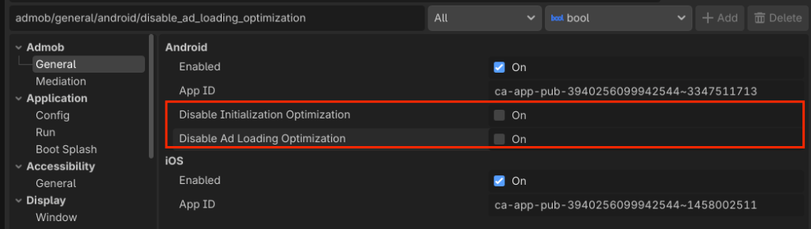

# 优化初始化和广告加载

本指南介绍如何在您的 Godot 项目中优化初始化和广告加载。

## 更新您的 Google Mobile Ads 设置

Google Mobile Ads Godot 插件默认启用优化，并指示 SDK 在后台线程上执行初始化和广告加载任务。

以下选项可在 Godot 项目设置中使用：

* 禁用初始化优化
* 禁用广告加载优化

勾选这些设置以指示 SDK 在主线程上初始化和加载广告：

| 设置 | 行为 |
| :--- | :--- |
| **Disable Initialization Optimization** | 禁用对 `MobileAds.initialize()` 初始化调用的优化。 |
| **Disable Ad Loading Optimization** | 禁用对所有广告格式的广告加载调用的优化。 |

您可以通过 Godot 项目设置菜单访问 Google Mobile Ads 设置：

**Project > Project Settings > Admob > General > Android**

选择后，设置界面将出现在 **Android** 部分下：

