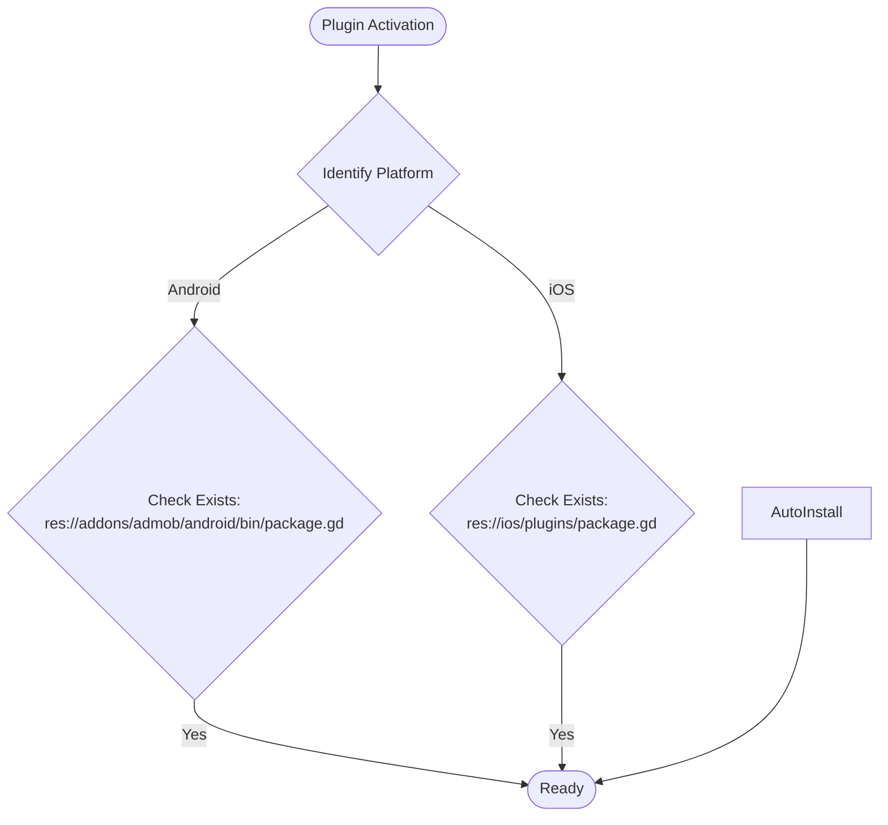

# Plugin Lifecycle

This document outlines the lifecycle of the plugin upon activation, specifically regarding dependency management for Android and iOS.

## Activation & Dependency Checks

When the plugin is activated, it executes a pipeline to verify the integrity and version of its native dependencies.

# Plugin Lifecycle

This document outlines the lifecycle of the plugin upon activation, specifically regarding dependency management for Android and iOS.

## Activation & Dependency Checks

When the plugin is activated, it executes a pipeline to verify the integrity and version of its native dependencies. The process is self-healing and semi-automated for both platforms.

### Common Flow

1.  **Platform Identification**: The plugin first identifies the target platform (Android or iOS).
2.  **File Existence Verification**: It checks for the existence of a platform-specific package file:
	*   **Android**: `res://addons/admob/android/bin/package.gd`
	*   **iOS**: `res://ios/plugins/package.gd`
3.  **Automatic Installation**: If the platform-specific package file is **missing**, the plugin automatically:
	*   Downloads the relevant platform binaries.
	*   Unzips them into the appropriate plugin directory (`res://addons/admob/android/bin/` for Android, `res://ios/plugins/` for iOS).

