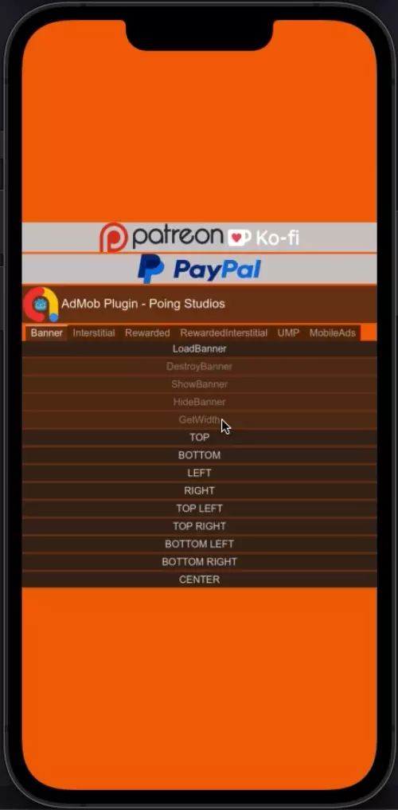

<h1 align="center">
   
  
   
  Godot AdMob iOS
   
</h1>

<h4 align="center">A Godot's plugin for iOS of <a href="https://admob.google.com" target="_blank">AdMob</a>.</h4>

  
  
  
  
  

  <a href="#❓-about">About</a> •
  <a href="#🙋‍♂️how-to-use">How to use</a> •
  <a href="#📄documentation">Docs</a> •
  <a href="https://github.com/poingstudios/godot-admob-plugin/releases">Downloads</a> 

## ❓ About 

This repository is for a _Godot Engine Plugin_ that allows showing the ads offered by **AdMob** in an **easy** way, without worrying about the building or version, **just download and use**.

The **purpose** of this plugin is to always keep **up to date with Godot**, supporting **ALMOST ALL** versions from v4.1+, and also make the code **compatible** on **[Android](https://github.com/poingstudios/godot-admob-android) and iOS**, so each advertisement will work **identically on both systems**.

### 🔑 Key features

- It's a wrapper for [Google Mobile Ads SDK](https://developers.google.com/admob/ios/download). 🎁
- Easy Configuration. 😀
- Supports nearly all Ad Formats: **Banner**, **Interstitial**, **Rewarded**, **Rewarded Interstitial**. 📺
- GDPR Compliance with UMP Support. ✉️
- Targeting Capabilities. 🎯
- Seamless integration with Mediation partners: **Meta**, **Vungle**. 💰
- CI/CD for streamlined development and deployment. 🔄🚀
- Features a dedicated [Godot Plugin](https://github.com/poingstudios/godot-admob-plugin), reducing the need for extensive coding. 🔌
- There is also an [Android Plugin](https://github.com/poingstudios/godot-admob-android) available, which has the same behavior. 🤖

## 🙋‍♂️How to use 
- We recommend you to use the [AdMob Plugin](https://github.com/poingstudios/godot-admob-plugin), you can download direcly from [Godot Asset Store](https://store.godotengine.org/asset/poingstudios/admob/).
- After download, we recommend you to read the [README.md](https://github.com/poingstudios/godot-admob-plugin/blob/master/README.md) of the Plugin to know how to use.

## 📦Installing:

### 📥Download
- To get started, download the `poing-godot-admob-ios-v{{ your_godot_version }}.zip` file from the [releases tab](https://github.com/poingstudios/godot-admob-plugin/releases). You can also use the [AdMob Plugin](https://github.com/poingstudios/godot-admob-plugin) for this step by navigating to `Project -> Tools -> AdMob Manager -> iOS -> Download & Install`.

### 🧑‍💻Usage
- Video tutorial: https://youtu.be/TB7WhP8mieo
- Inside `poing-godot-admob-ios-v{{ your_godot_version }}.zip` you downloaded, extract everything into the `res://ios/plugins` directory of your Godot project.
- Update the configuration in `res://ios/plugins/poing-godot-admob-ads.gdip`. The `GADApplicationIdentifier` must be changed to your App ID.
- Export the project from Godot, enabling the `Ad Mob` plugin (and any mediation plugins) in the export options.
- **That's it!** The plugin now uses `.xcframework` bundles that are automatically integrated by Godot. No manual Xcode steps or CocoaPods commands are required.

## 📎Useful links:
- 🦾 Godot Plugin: https://github.com/poingstudios/godot-admob-plugin
- 🤖 Android: https://github.com/poingstudios/godot-admob-android
- ⏳ Plugin for Godot below v4.1: https://github.com/poingstudios/godot-admob-ios/tree/v2

## 📄Documentation
For a complete documentation of this Plugin: [check here](https://poingstudios.github.io/godot-admob-plugin/).

Alternatively, you can check the docs of AdMob itself of [iOS](https://developers.google.com/admob/ios/quick-start).

## 🙏 Support
If you find our work valuable and would like to support us, consider contributing via these platforms:

Your support helps us continue to improve and maintain this plugin. Thank you for being a part of our community!

## 🆘Getting help

